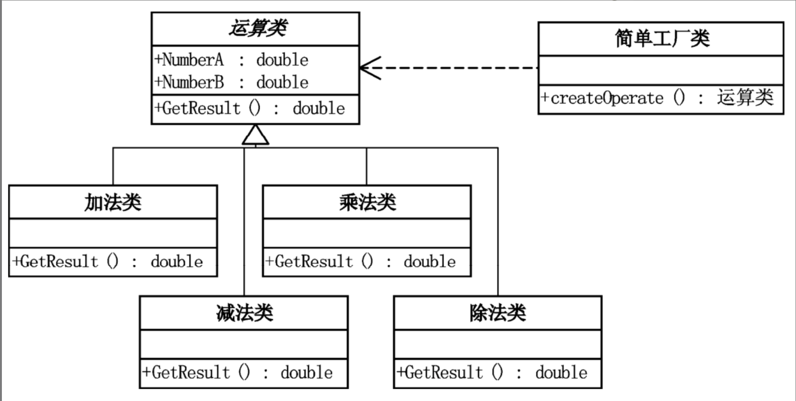

[1]: https://juejin.cn/post/6844903703447765005
[2]: https://github.com/hzgaoshichao/playwithdesignpattern/tree/main/chapter01/1.10-simplefactory
[3]: https://design-patterns.readthedocs.io/zh-cn/latest/creational_patterns/simple_factory.html
[4]: https://book.douban.com/subject/2334288/
[5]: https://design-patterns.readthedocs.io/zh-cn/latest/index.html
## 关于
<<大话设计模式 Golang 版>> 是将 [<<大话设计模式 (作者:程杰)>>][4] 里面的 Java 代码用 Golang 重新写了一遍, 然后结合 [图说设计模式][5] 做总结归纳

## 简述
简单工厂模式(Simple Factory Pattern)：又称为静态工厂方法(Static Factory Method)模式，它属于类创建型模式。在简单工厂模式中，可以根据参数的不同返回不同类的实例。简单工厂模式专门定义一个类来负责创建其他类的实例，被创建的实例通常都具有共同的父类。

## UML 结构
下面的 UML 图是原书中使用 Java 的 UML 图, 由于 Golang 中没有抽象类, 所以在代码实现时需要将 Java 中的抽象类转换为接口来实现

- 简单工厂类和运算类是一种依赖关系，使用带箭头的虚线表示；

**依赖关系(dependency)**  
依赖关系是用一套带箭头的虚线表示的；如上图表示简单工厂类依赖于运算类；他描述一个对象在运行期间会用到另一个对象的关系；  

与关联关系不同的是，它是一种临时性的关系，通常在运行期间产生，并且随着运行时的变化； 依赖关系也可能发生变化；  

显然，依赖也有方向，双向依赖是一种非常糟糕的结构，我们总是应该保持单向依赖，杜绝双向依赖的产生；  

注：在最终代码中，依赖关系体现为类构造方法及类方法的传入参数，箭头的指向为调用关系；依赖关系除了临时知道对方外，还“使用”对方的方法和属性；
## 代码实现
源码下载地址: [github.com/chapter01/1.10-simplefactory][2]

## 典型应用场景
- 简单工厂模式的要点在于：当你需要什么，只需要传入一个正确的参数，就可以获取你所需要的对象，而无须知道其创建细节。简单工厂模式结构比较简单，其核心是工厂类的设计
- 工厂类负责创建的对象比较少：由于创建的对象较少，不会造成工厂方法中的业务逻辑太过复杂。
- 客户端只知道传入工厂类的参数，对于如何创建对象不关心：客户端既不需要关心创建细节，甚至连类名都不需要记住，只需要知道类型所对应的参数。

## 优缺点
### 优点
- 工厂类含有必要的判断逻辑，可以决定在什么时候创建哪一个产品类的实例，客户端可以免除直接创建产品对象的责任，而仅仅“消费”产品；简单工厂模式通过这种做法实现了对责任的分割，它提供了专门的工厂类用于创建对象。
- 客户端无须知道所创建的具体产品类的类名，只需要知道具体产品类所对应的参数即可，对于一些复杂的类名，通过简单工厂模式可以减少使用者的记忆量。
- 通过引入配置文件，可以在不修改任何客户端代码的情况下更换和增加新的具体产品类，在一定程度上提高了系统的灵活性。

## 缺点
- 由于工厂类集中了所有产品创建逻辑，一旦不能正常工作，整个系统都要受到影响。
- 使用简单工厂模式将会增加系统中类的个数，在一定程序上增加了系统的复杂度和理解难度。
- 系统扩展困难，一旦添加新产品就不得不修改工厂逻辑，在产品类型较多时，有可能造成工厂逻辑过于复杂，不利于系统的扩展和维护

## 参考链接
- [golang设计模式之简单工厂模式: https://juejin.cn][1]  
- [图说设计模式: https://design-patterns.readthedocs.io/][3]
