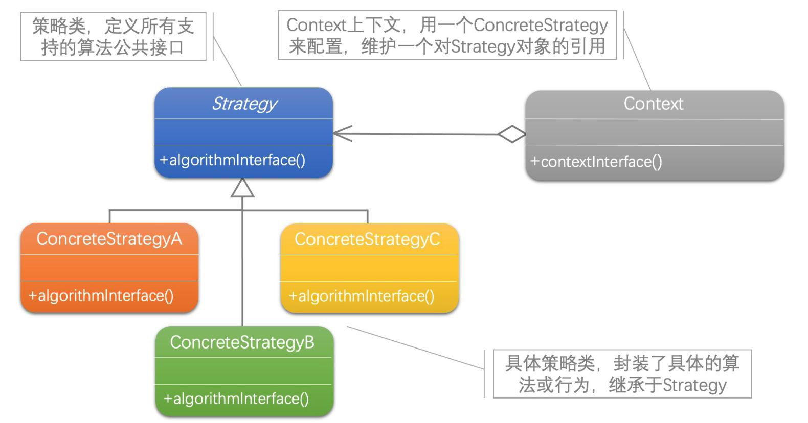

[1]: https://juejin.cn/post/6844903703447765005
[2]: https://github.com/hzgaoshichao/playwithdesignpattern/tree/main/chapter02
[3]: https://design-patterns.readthedocs.io/zh-cn/latest/behavioral_patterns/strategy.html
[4]: https://book.douban.com/subject/36116620/
[5]: https://design-patterns.readthedocs.io/zh-cn/latest/index.html
## 关于
**大话设计模式 Golang 版** 是将 [<<大话设计模式【Java溢彩加强版】(作者:程杰)>>][4] 里面的 Java 代码用 Golang 重新写了一遍, 然后结合 [图说设计模式][5] 做总结归纳

## 简述
策略模式(Strategy Pattern)：定义一系列算法，将每一个算法封装起来，并让它们可以相互替换。策略模式让算法独立于使用它的客户而变化，也称为政策模式(Policy)。

## UML 结构
下面的 UML 图是原书中使用 Java 的 UML 图, 由于 Golang 中没有抽象类, 所以在代码实现时需要将 Java 中的抽象类转换为接口来实现

- Context 和 Strategy 是一种聚合关系(aggregation)，用一条带空心菱形箭头的直线表示；

**聚合关系(aggregation)**  
聚合关系用一条带空心菱形箭头的直线表示，如上图表示 Strategy 聚合到 Context 上，或者说 Context 由 Strategy 组成；

聚合关系用于表示实体对象之间的关系，表示整体由部分构成的语义, 表示一种弱的 "拥有"关系, 体现的是A对象可以包含B对象, 但是B对象不是A对象的一部分；例如一个部门由多个员工组成；

与组合关系不同的是，整体和部分不是强依赖的，即使整体不存在了，部分仍然存在；例如， 部门撤销了，人员不会消失，他们依然存在；  

## 代码实现
**源码下载地址**: [github.com/chapter02/][2]

## 典型应用场景
在以下情况下可以使用策略模式：

- 如果在一个系统里面有许多类，它们之间的区别仅在于它们的行为，那么使用策略模式可以动态地让一个对象在许多行为中选择一种行为。
- 一个系统需要动态地在几种算法中选择一种。
- 如果一个对象有很多的行为，如果不用恰当的模式，这些行为就只好使用多重的条件选择语句来实现。
- 不希望客户端知道复杂的、与算法相关的数据结构，在具体策略类中封装算法和相关的数据结构，提高算法的保密性与安全性

## 优缺点
### 优点
- 策略模式提供了对“开闭原则”的完美支持，用户可以在不修改原有系统的基础上选择算法或行为，也可以灵活地增加新的算法或行为。
- 策略模式提供了管理相关的算法族的办法。
- 策略模式提供了可以替换继承关系的办法。
- 使用策略模式可以避免使用多重条件转移语句。

### 缺点
- 客户端必须知道所有的策略类，并自行决定使用哪一个策略类。
- 策略模式将造成产生很多策略类，可以通过使用享元模式在一定程度上减少对象的数量。

## 参考链接
- [图说设计模式: https://design-patterns.readthedocs.io/][3]
