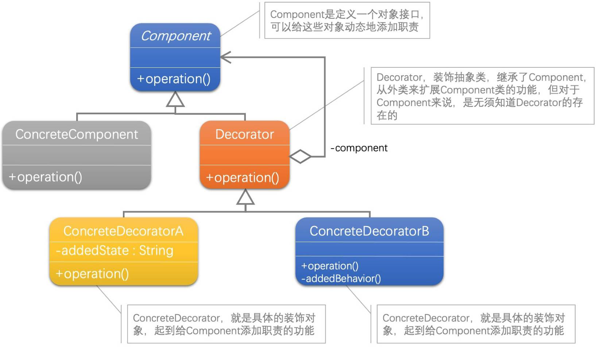

[1]: https://juejin.cn/post/6844903703447765005
[2]: https://github.com/hzgaoshichao/playwithdesignpattern/tree/main/chapter06
[3]: https://design-patterns.readthedocs.io/zh-cn/latest/structural_patterns/decorator.html
[4]: https://book.douban.com/subject/36116620/
[5]: https://design-patterns.readthedocs.io/zh-cn/latest/index.html
## 关于
**大话设计模式 Golang 版** 是将 [<<大话设计模式【Java溢彩加强版】(作者:程杰)>>][4] 里面的 Java 代码用 Golang 重新写了一遍, 然后结合 [图说设计模式][5] 做总结归纳

## 简述
装饰模式(Decorator Pattern) ：动态地给一个对象增加一些额外的职责(Responsibility)，就增加对象功能来说，装饰模式比生成子类实现更为灵活。其别名也可以称为包装器(Wrapper)，与适配器模式的别名相同，但它们适用于不同的场合。根据翻译的不同，装饰模式也有人称之为“油漆工模式”，它是一种对象结构型模式。

## UML 结构
下面的 UML 图是原书中使用 Java 的 UML 图, 由于 Golang 中没有抽象类, 所以在代码实现时需要将 Java 中的抽象类转换为接口来实现

 

- Decorator 和 Component 是一种聚合关系(aggregation)，用一条带空心菱形箭头的直线表示；

**聚合关系(aggregation)**  
聚合关系用一条带空心菱形箭头的直线表示，如上图表示 Component 聚合到 Decorator 上，或者说 Decorator 由 Component 组成；

聚合关系用于表示实体对象之间的关系，表示整体由部分构成的语义, 表示一种弱的 "拥有"关系, 体现的是A对象可以包含B对象, 但是B对象不是A对象的一部分；例如一个部门由多个员工组成；

与组合关系不同的是，整体和部分不是强依赖的，即使整体不存在了，部分仍然存在；例如， 部门撤销了，人员不会消失，他们依然存在；  


## 代码实现
**源码下载地址**: [github.com/chapter06/][2]

由于 Golang 中没有抽象类, 实现方式上和 Java 有些不同:

Component 是个接口类型
```go
type Component interface {
	Operation()
}

type ConcreteComponent struct {
}

func (c *ConcreteComponent) Operation() {
	fmt.Println("具体对象的实际操作")
}
```

Decorator 也是个接口类型, 然后将 Component 嵌入到 Decorator. 注意 DecoratorCommon 的使用, 我们可以将具体装饰器 (ConcreteDecoratorA )共同的部分提取到这个结构体中, 然后在具体装饰器中嵌入 DecoratorCommon 结构体, 这样的实现就类似于 Java 中的抽象类.
```go
type Decorator interface {
	Component
	SetComponent()
}

type DecoratorCommon struct {
	component Component
}

func (c *DecoratorCommon) SetComponent(component Component) {
	c.component = component
}

func (c *DecoratorCommon) Operation() {
	if c.component != nil {
		c.component.Operation()
	} else {
		fmt.Println("component is nil")
	}
}

type ConcreteDecoratorA struct {
	DecoratorCommon
	addedState string
}

func (c *ConcreteDecoratorA) Operation() {
	c.DecoratorCommon.Operation()

	c.addedState = "具体装饰对象 A 的独有操作"
	fmt.Println(c.addedState)
}
```


## 典型应用场景
在以下情况下可以使用策略模式：
- 在不影响其他对象的情况下，以动态、透明的方式给单个对象添加职责。
- 需要动态地给一个对象增加功能，这些功能也可以动态地被撤销。

## 优缺点
### 优点
- 把类中的装饰功能从类中搬移去除，这样可以简化原有的类。有效地把类的核心职责和装饰功能区分开了。而且可以去除相关类中重复的装饰逻辑。
- 通过使用不同的具体装饰类以及这些装饰类的排列组合，可以创造出很多不同行为的组合。可以使用多个具体装饰类来装饰同一对象，得到功能更为强大的对象。
- 具体构件类与具体装饰类可以独立变化，用户可以根据需要增加新的具体构件类和具体装饰类，在使用时再对其进行组合，原有代码无须改变，符合“开闭原则”


### 缺点
- 使用装饰模式进行系统设计时将产生很多小对象，这些对象的区别在于它们之间相互连接的方式有所不同，而不是它们的类或者属性值有所不同，同时还将产生很多具体装饰类。这些装饰类和小对象的产生将增加系统的复杂度，加大学习与理解的难度。
- 这种比继承更加灵活机动的特性，也同时意味着装饰模式比继承更加易于出错，排错也很困难，对于多次装饰的对象，调试时寻找错误可能需要逐级排查，较为烦琐。

## 参考链接
- [图说设计模式: https://design-patterns.readthedocs.io/][3]
