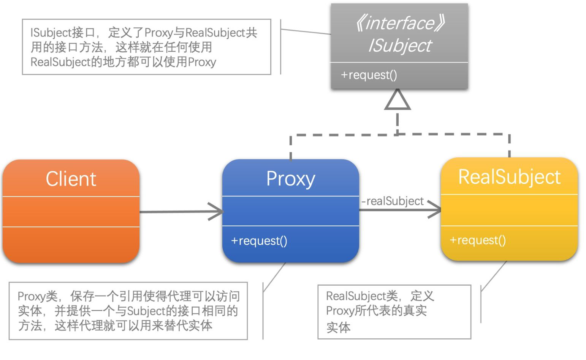

[1]: https://juejin.cn/post/6844903703447765005
[2]: https://github.com/hzgaoshichao/playwithdesignpattern/tree/main/chapter07
[3]: https://design-patterns.readthedocs.io/zh-cn/latest/structural_patterns/proxy.html
[4]: https://book.douban.com/subject/36116620/
[5]: https://design-patterns.readthedocs.io/zh-cn/latest/index.html
[6]: https://github.com/ruanrunxue/Practice-Design-Pattern--Go-Implementation/blob/main/docs/go_practice_design_pattern__proxy.md

## 关于
**大话设计模式 Golang 版** 是将 [<<大话设计模式【Java溢彩加强版】(作者:程杰)>>][4] 里面的 Java 代码用 Golang 重新写了一遍, 然后结合 [图说设计模式][5] 做总结归纳

## 简述
代理模式 (Proxy Pattern) ：给某一个对象提供一个代 理，并由代理对象控制对原对象的引用。代理模式的英 文叫做Proxy或Surrogate，它是一种对象结构型模式。

在某些情况下，一个客户不想或者不能直接引用一个对 象，此时可以通过一个称之为“代理”的第三者来实现间接引用。代理对象可以在客户端和目标对象之间起到中介的作用，并且可以通过代理对象去掉客户不能看到的内容和服务或者添加客户需要的额外服务。

通过引入一个新的对象（如小图片和远程代理对象）来实现对真实对象的操作或者将新的对象作为真实对象的一个替身，这种实现机制即为代理模式，通过引入代理对象来间接访问一个对象，这就是代理模式的模式动机。

## UML 结构
下面的 UML 图是原书中使用 Java 的 UML 图, 由于 Golang 中没有抽象类, 所以在代码实现时需要将 Java 中的抽象类转换为接口来实现

- Proxy 和 RealSubject 是一种关联关系(association)，用一条带箭头的直线表示；

**关联关系(association)**  
关联关系是用一条直线表示的；它描述不同类的对象之间的结构关系；它是一种静态关系， 通常与运行状态无关，一般由常识等因素决定的；它一般用来定义对象之间静态的、天然的结构； 所以，关联关系是一种“强关联”的关系；

比如，乘车人和车票之间就是一种关联关系；学生和学校就是一种关联关系；

关联关系默认不强调方向，表示对象间相互知道；如果特别强调方向，如上图，表示 Proxy 知道 RealSubject，但 RealSubject 不知道 Proxy；

注：在最终代码中，关联对象通常是以成员变量的形式实现的；

## 代码实现
**源码下载地址**: [github.com/chapter07/][2]

## 典型应用场景
在以下情况下可以使用代理模式 (Proxy Pattern)：

- 远程 (Remote) 代理：为一个位于不同的地址空间的对象提供一个本地的代理对象，这个不同的地址空间可以是在同一台主机中，也可是在 另一台主机中，远程代理又叫做大使(Ambassador)。
- 虚拟 (Virtual) 代理：如果需要创建一个资源消耗较大的对象，先创建一个消耗相对较小的对象来表示，真实对象只在需要时才会被真正创建。
- 安全代理：用来控制真实对象访问时的权限
- 缓冲 (Cache) 代理：为某一个目标操作的结果提供临时的存储空间，以便多个客户端可以共享这些结果。
- 智能引用 (Smart Reference) 代理：当一个对象被引用时，提供一些额外的操作，如将此对象被调用的次数记录下来等。

缓冲 (Cache) 代理的一个例子， 可以参考：[简单的分布式应用系统][6]

## 优缺点
### 优点
- 代理模式能够协调调用者和被调用者，在一定程度上降低了系统的耦合度。
- 远程代理使得客户端可以访问在远程机器上的对象，远程机器可能具有更好的计算性能与处理速度，可以快速响应并处理客户端请求。
- 虚拟代理通过使用一个小对象来代表一个大对象，可以减少系 统资源的消耗，对系统进行优化并提高运行速度。
- 保护代理可以控制对真实对象的使用权限。

### 缺点
- 由于在客户端和真实主题之间增加了代理对象，因此有些类型的代理模式可能会造成请求的处理速度变慢。
- 实现代理模式需要额外的工作，有些代理模式的实现非常复杂

## 参考链接
- [图说设计模式: https://design-patterns.readthedocs.io/][3]
