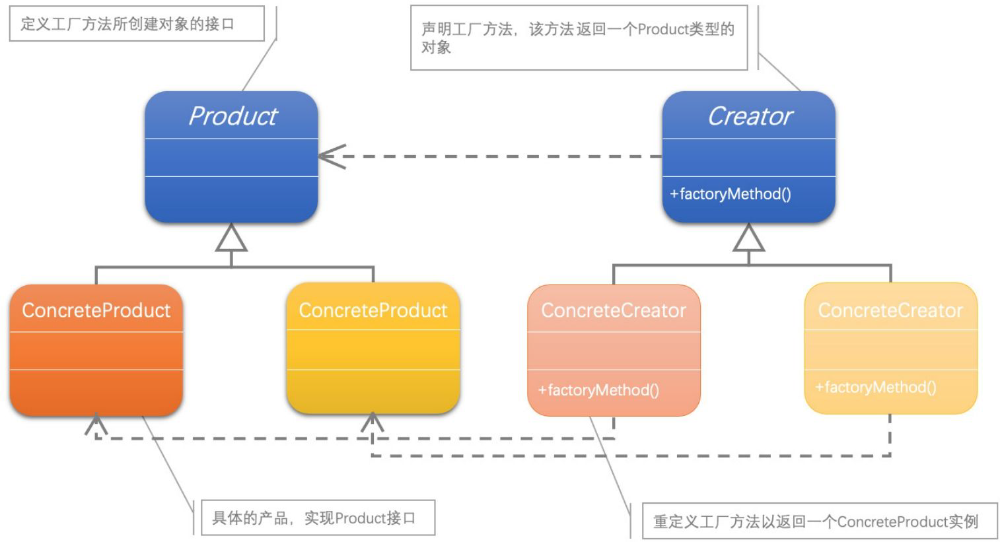

[1]: https://juejin.cn/post/6844903703447765005
[2]: https://github.com/hzgaoshichao/playwithdesignpattern/tree/main/chapter08
[3]: https://design-patterns.readthedocs.io/zh-cn/latest/creational_patterns/factory_method.html
[4]: https://book.douban.com/subject/36116620/
[5]: https://design-patterns.readthedocs.io/zh-cn/latest/index.html

## 关于
**大话设计模式 Golang 版** 是将 [<<大话设计模式【Java溢彩加强版】(作者:程杰)>>][4] 里面的 Java 代码用 Golang 重新写了一遍, 然后结合 [图说设计模式][5] 做总结归纳

## 简述
工厂方法模式 (Factory Method Pattern) 又称为工厂模式，也叫虚拟构造器 (Virtual Constructor) 模式或者多态工厂 (Polymorphic Factory) 模式，它属于类创建型模式。在工厂方法模式中，工厂父类负责定义创建产品对象的公共接口，而工厂子类则负责生成具体的产品对象，这样做的目的是将产品类的实例化操作**延迟到工厂子类**中完成，即通过工厂子类来确定究竟应该实例化哪一个具体产品类。

注意关键字： ***延迟到工厂子类***

工厂方法模式是简单工厂模式的进一步抽象和推广。由于使用了面向对象的多态性，工厂方法模式保持了简单工厂模式的优点，而且克服了它的缺点。在工厂方法模式中，核心的工厂类不再负责所有产品的创建，而是将具体创建工作交给子类去做。这个核心类仅仅负责给出具体工厂必须实现的接口，而不负责哪一个产品类被实例化这种细节，这使得工厂方法模式可以允许系统在不修改工厂角色的情况下引进新产品。

## UML 结构
下面的 UML 图是原书中使用 Java 的 UML 图, 由于 Golang 中没有抽象类, 所以在代码实现时需要将 Java 中的抽象类转换为接口来实现

- Creator 和 Product 是一种依赖关系，使用带箭头的虚线表示；

**依赖关系 (dependency)**   

依赖关系是用一套带箭头的虚线表示的；如上图表示简单工厂类依赖于运算类；他描述一个对象在运行期间会用到另一个对象的关系；

与关联关系不同的是，它是一种临时性的关系，通常在运行期间产生，并且随着运行时的变化； 依赖关系也可能发生变化；

显然，依赖也有方向，双向依赖是一种非常糟糕的结构，我们总是应该保持单向依赖，杜绝双向依赖的产生；

注：在最终代码中，依赖关系体现为类构造方法及类方法的传入参数，箭头的指向为调用关系；依赖关系除了临时知道对方外，还“使用”对方的方法和属性；

## 代码实现
**源码下载地址**: [github.com/chapter08/][2]

## 典型应用场景
在以下情况下可以使用工厂方法模式：

- 一个类不知道它所需要的对象的类：在工厂方法模式中，客户端不需要知道具体产品类的类名，只需要知道所对应的工厂即可，具体的产品对象由具体工厂类创建；客户端需要知道创建具体产品的工厂类。
- 一个类通过其子类来指定创建哪个对象：在工厂方法模式中，对于抽象工厂类只需要提供一个创建产品的接口，而由其子类来确定具体要创建的对象，利用面向对象的多态性和里氏代换原则，在程序运行时，子类对象将覆盖父类对象，从而使得系统更容易扩展。
- 将创建对象的任务委托给多个工厂子类中的某一个，客户端在使用时可以无须关心是哪一个工厂子类创建产品子类，需要时再动态指定，可将具体工厂类的类名存储在配置文件或数据库中。

## 优缺点
### 优点
- 在工厂方法模式中，工厂方法用来创建客户所需要的产品，同时还向客户隐藏了哪种具体产品类将被实例化这一细节，用户只需要关心所需产品对应的工厂，无须关心创建细节，甚至无须知道具体产品类的类名。
- 基于工厂角色和产品角色的多态性设计是工厂方法模式的关键。它能够使工厂可以自主确定创建何种产品对象，而如何创建这个对象的细节则完全封装在具体工厂内部。工厂方法模式之所以又被称为多态工厂模式，是因为所有的具体工厂类都具有同一抽象父类。
- 使用工厂方法模式的另一个优点是在系统中加入新产品时，无须修改抽象工厂和抽象产品提供的接口，无须修改客户端，也无须修改其他的具体工厂和具体产品，而只要添加一个具体工厂和具体产品就可以了。这样，系统的可扩展性也就变得非常好，完全符合“开闭原则”。

### 缺点
- 由于考虑到系统的可扩展性，需要引入抽象层，在客户端代码中均使用抽象层进行定义，增加了系统的抽象性和理解难度，且在实现时可能需要用到DOM、反射等技术，增加了系统的实现难度。

## 参考链接
- [图说设计模式: https://design-patterns.readthedocs.io/][3]
