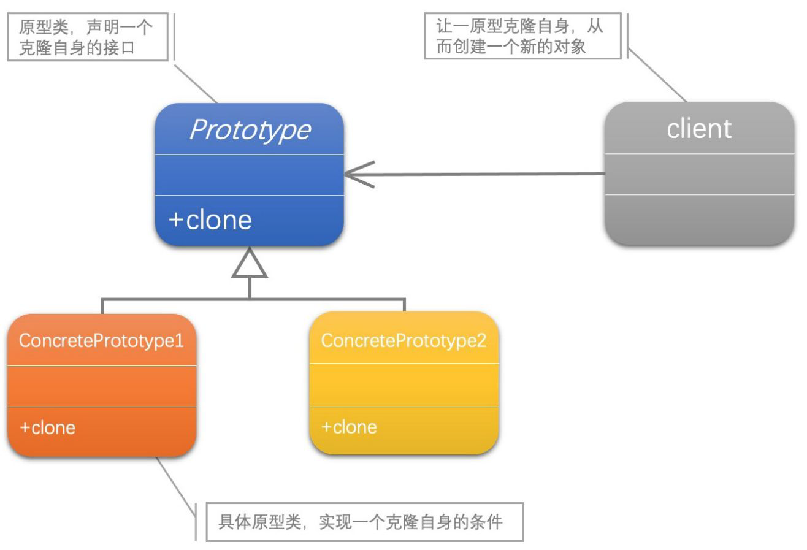

[1]: https://juejin.cn/post/6844903703447765005
[2]: https://github.com/hzgaoshichao/playwithdesignpattern/tree/main/chapter09
[3]: https://github.com/ruanrunxue/Practice-Design-Pattern--Go-Implementation/blob/main/docs/go_practice_design_pattern__prototype.md
[4]: https://book.douban.com/subject/36116620/
[5]: https://design-patterns.readthedocs.io/zh-cn/latest/index.html

## 关于
**大话设计模式 Golang 版** 是将 [<<大话设计模式【Java溢彩加强版】(作者:程杰)>>][4] 里面的 Java 代码用 Golang 重新写了一遍, 然后结合 [图说设计模式][5] 做总结归纳

这篇文章主要参考了：[【Go实现】实践GoF的23种设计模式: 原型模式][3]

## 简述
定义： 原型模式（Prototype），用原型实例指定创建对象的种类，并且通过复制这些原型创建新的对象。

最简单直接的对象复制方式是这样的：重新实例化一个该对象的实例，然后遍历原始对象的所有成员变量， 并将成员变量值复制到新实例中。但这种方式的缺点也很明显：

1. 客户端程序必须清楚对象的实现细节。暴露细节往往不是件好事，它会导致代码耦合过深。
2. 对象可能存在一些私有属性，客户端程序无法访问它们，也就无法复制。
3. 很难保证所有的客户端程序都能完整不漏地把所有成员属性复制完。

更好的方法是使用原型模式，将复制逻辑委托给对象本身，这样，上述两个问题也都解决了。

## UML 结构
下面的 UML 图是原书中使用 Java 的 UML 图, 由于 Golang 中没有抽象类, 所以在代码实现时需要将 Java 中的抽象类转换为接口来实现



## 代码实现
**源码下载地址**: [github.com/chapter09/][2]

**浅拷贝和深拷贝**
如果原型对象的成员属性包含了`指针类型`，那么就会存在`浅拷贝`和`深拷贝`两种复制方式。
比如示例代码中的 `work *workExperience` 就是指针类型，浅拷贝的做法是直接复制指针，深拷贝的做法则是创建新的 workExperience 对象。
另外，深拷贝要深入到多少层，需要事先就考虑好，而且需要当心出现循环引用的问题，需要小心处理

```go
type Resume struct {
	name string
	sex  string
	age  string
	work *workExperience
}
```
这里的`Clone()` 方法就是用的深拷贝
```go
func (w *workExperience) Clone() cloneable {
	newWorkExperience := *w
	return &newWorkExperience
}
```
## 典型应用场景
在以下情况下可以使用工厂方法模式：

- 不管是复杂还是简单的对象，只要存在对象复制的场景，都适合使用原型模式。

## 优缺点
### 优点
- 对客户端隐藏实现细节，有利于避免代码耦合。
- 让客户端代码更简洁，有利于提升可读性。
- 可方便地复制复杂对象，有利于杜绝客户端复制对象时的低级错误，比如漏复制属性。

### 缺点
- 某些业务场景需要警惕浅拷贝问题。

## 参考链接
- [实践GoF的23种设计模式: 原型模式: https://github.com/ruanrunxue/Practice-Design-Pattern--Go-Implementation][3]
