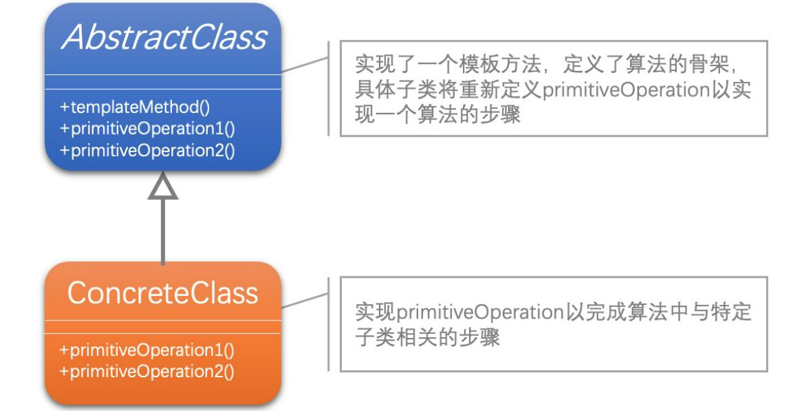
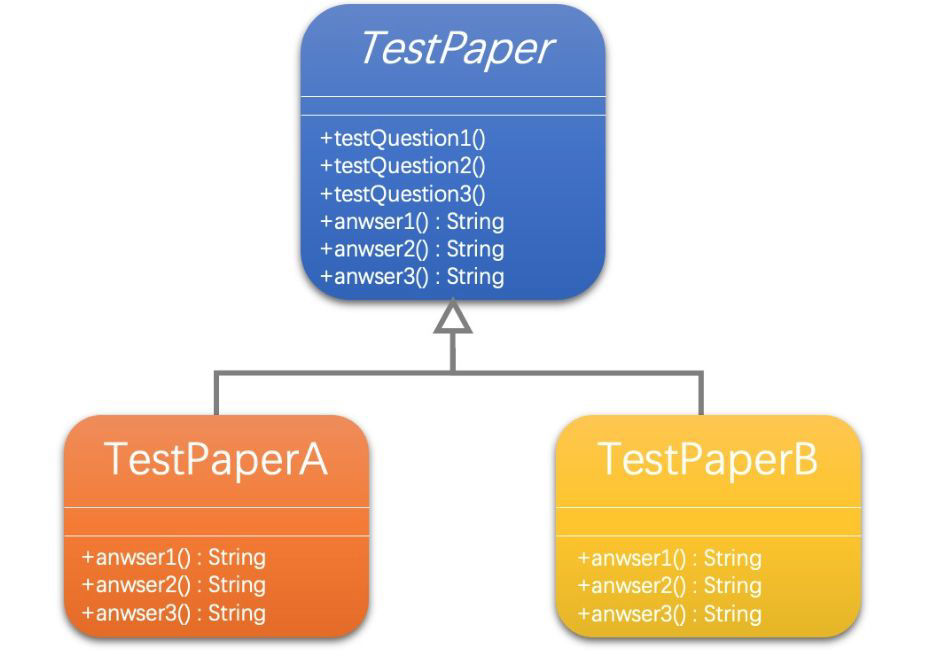

[1]: https://juejin.cn/post/6844903703447765005
[2]: https://github.com/hzgaoshichao/playwithdesignpattern/tree/main/chapter10
[4]: https://book.douban.com/subject/36116620/
[5]: https://design-patterns.readthedocs.io/zh-cn/latest/index.html
## 关于
**大话设计模式 Golang 版** 是将 [<<大话设计模式【Java溢彩加强版】(作者:程杰)>>][4] 里面的 Java 代码用 Golang 重新写了一遍, 然后结合 [图说设计模式][5] 做总结归纳

模板方法模式是通过把不变行为搬移到超类，去除子类中的重复代码来体现它的优势。
模板方法模式就是提供了一个很好的代码复用平台。
当不变的和可变的行为在方法的子类实现中混合在一起的时候，不变的行为就会在子类中重复出现。我们通过模板方法模式把这些行为搬移到单一的地方，这样就帮助子类摆脱重复的不变行为的纠缠。
## 简述
模板模式(Template Pattern )又被称作模板方法模式( Template Method Pattern)，它是一种简单的、常见的且应用非常广泛的模式。定义一个操作中的算法的框架，而将一些步骤延迟到子类中。使得子类可以不改变一个算法的结构即可重定义该算法的某些特定步骤。

## UML 结构
下面的 UML 图是原书中使用 Java 的 UML 图, 由于 Golang 中没有抽象类, 所以在代码实现时需要将 Java 中的抽象类转换为接口来实现



## 代码实现
**源码下载地址**: [github.com/chapter10][2]

**示例代码 UML**



下面为示例代码，其中 `testPaperCommon` 相当于抽象类，这里使用接口作为方法的参数， 这样可以调用具体的实现结构体中的方法。`TemplateMethod(t testPaper)` 为模板方法，用来定义算法的顺序。

```go
package testpaper

import "fmt"

type testPaper interface {
	testQuestion1(p testPaper)
	answer1() string
	testQuestion2(p testPaper)
	answer2() string
	testQuestion3(p testPaper)
	answer3() string
}

type testPaperCommon struct {
}

func (t *testPaperCommon) testQuestion1(p testPaper) {
	fmt.Printf("Question 1:杨过得到，后来给了郭靖，炼成倚天剑、屠龙刀的玄铁可能是[ ] : a.球磨铸铁 b.马口铁 c.高速合金钢 d.碳素纤维 \n")
	fmt.Printf("答案: %v \n", p.answer1())
}

func (t *testPaperCommon) testQuestion2(p testPaper) {
	fmt.Printf("Question 2:杨过、程英、陆无双铲除了情花，造成[ ] : a.使这种植物不再害人 b.使一种珍稀物种灭绝 c.破坏了那个生物圈的生态平衡 d.造成该地区沙漠化 \n")
	fmt.Printf("答案: %v \n", p.answer2())
}

func (t *testPaperCommon) testQuestion3(p testPaper) {
	fmt.Printf("Question 3:蓝凤凰致使华山师徒、桃谷六仙呕吐不止,如果你是大夫,会给他们开什么药[ ] : a.阿司匹林 b.牛黄解毒片 c.氟哌酸 d.让他们喝大量的生牛奶 e.以上全不对 \n")
	fmt.Printf("答案: %v \n", p.answer3())
}

func TemplateMethod(t testPaper) {
	t.testQuestion1(t)
	t.testQuestion2(t)
	t.testQuestion3(t)
}

```
在具体的实现结构体 `TestPaperA` 中， 我们将 `testPaperCommon` 嵌入到 `TestPaperA`， 这样只需要重写需要的方法即可。

```go
package testpaper

type TestPaperA struct {
	testPaperCommon
}

func (t *TestPaperA) answer1() string {
	return "b"
}

func (t *TestPaperA) answer2() string {
	return "a"
}

func (t *TestPaperA) answer3() string {
	return "c"
}
```


## 典型应用场景
- 可以把重要的、复杂的、核心算法设计为模板方法，其他的相关细节功能则由各个子类实现;
- 当不变的和可变的行为在方法的子类实现中混合在一起的时候，不变的行为就会在子类中重复出现。我们通过模板方法模式把这些行为搬移到单一的地方，这样就帮助子类摆脱重复的不变行为的纠缠

## 优缺点
### 优点
- 提高了代码的复用性，将相同部分的代码放在抽象的父类中;
- 提高了拓展性:将不同的代码放入不同的子类中，通过对子类的扩展增加新的行为;符合开闭原则:行为由父类控制，通过子类扩展新的行为。

### 缺点
- 模板方法模式中，父类定义了算法的整体结构，子类只能定制其中的某些步骤，无法改变整体结构。这可能会限制子类的选择，使得一些特殊情况下的定制变得困难。


## 参考链接
- [图说设计模式: https://design-patterns.readthedocs.io/][5]
