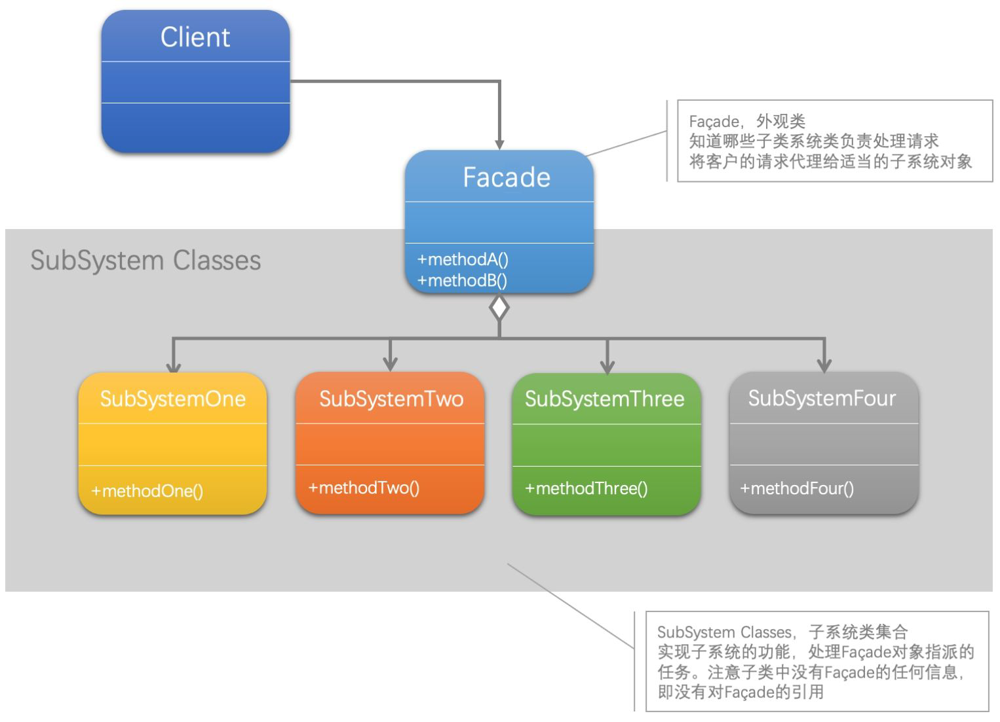

[1]: https://juejin.cn/post/6844903703447765005
[2]: https://github.com/hzgaoshichao/playwithdesignpattern/tree/main/chapter12
[3]: https://design-patterns.readthedocs.io/zh-cn/latest/structural_patterns/facade.html
[4]: https://book.douban.com/subject/36116620/
[5]: https://design-patterns.readthedocs.io/zh-cn/latest/index.html
## 关于
**大话设计模式 Golang 版** 是将 [<<大话设计模式【Java溢彩加强版】(作者:程杰)>>][4] 里面的 Java 代码用 Golang 重新写了一遍, 然后结合 [图说设计模式][5] 做总结归纳

## 简述
外观模式(Facade Pattern)：外部与一个子系统的通信必须通过一个统一的外观对象进行，为子系统中的一组接口提供一个一致的界面，外观模式定义了一个高层接口，这个接口使得这一子系统更加容易使用。外观模式又称为门面模式，它是一种对象结构型模式。

根据“单一职责原则”，在软件中将一个系统划分为若干个子系统有利于降低整个系统的复杂性，一个常见的设计目标是使子系统间的通信和相互依赖关系达到最小，而达到该目标的途径之一就是引入一个外观对象，它为子系统的访问提供了一个简单而单一的入口。 -外观模式也是“`迪米特法则`”的体现，通过引入一个新的外观类可以降低原有系统的复杂度，同时降低客户类与子系统类的耦合度。 - 外观模式要求一个子系统的外部与其内部的通信通过一个统一的外观对象进行，外观类将客户端与子系统的内部复杂性分隔开，使得客户端只需要与外观对象打交道，而不需要与子系统内部的很多对象打交道。 -外观模式的目的在于降低系统的复杂程度。 -外观模式从很大程度上提高了客户端使用的便捷性，使得客户端无须关心子系统的工作细节，通过外观角色即可调用相关功能。

**迪米特法则（LoD）**：如果两个类不必彼此直接通信，那么这两个类就不应当发生直接的相互作用。如果其中一个类需要调用另一个类的某一个方法的话，可以通过第三者转发这个调用。

## UML 结构
下面的 UML 图是原书中使用 Java 的 UML 图

- Facade 和 SubSystemOne... 之间是一种聚合关系(aggregation)，用一条带空心菱形箭头的直线表示；

**聚合关系(aggregation)**
聚合关系用一条带空心菱形箭头的直线表示，如上图表示 SubSystemOne... 聚合到 Facade 上，或者说 Facade 由 SubSystemOne, SubSystemTwo, SubSystemThree, SubSystemFour 组成；

聚合关系用于表示实体对象之间的关系，表示整体由部分构成的语义, 表示一种弱的 "拥有"关系, 体现的是A对象可以包含B对象, 但是B对象不是A对象的一部分；例如一个部门由多个员工组成；

与组合关系不同的是，整体和部分不是强依赖的，即使整体不存在了，部分仍然存在；例如， 部门撤销了，人员不会消失，他们依然存在

## 代码实现
**源码下载地址**: [github.com/chapter12][2]

## 典型应用场景
- 首先，在设计初期阶段，应该要有意识地将不同的两个层分离，比如经典的三层架构，就需要考虑在数据访问层和业务逻辑层、业务逻辑层和表示层的层与层之间建立外观Facade，这样可以为复杂的子系统提供一个简单的接口，使得耦合大大降低。
- 其次，在开发阶段，子系统往往因为不断的重构演化而变得越来越复杂，大多数的模式使用时也都会产生很多很小的类，这本是好事，但也给外部调用它们的用户程序带来了使用上的困难，增加外观Facade可以提供一个简单的接口，减少它们之间的依赖。
- 第三，在维护一个遗留的大型系统时，可能这个系统已经非常难以维护和扩展了，但因为它包含非常重要的功能，新的需求开发必须要依赖于它。此时用外观模式Facade也是非常合适的。你可以为新系统开发一个外观Facade类，来提供设计粗糙或高度复杂的遗留代码的比较清晰简单的接口，让新系统与Facade对象交互，Facade与遗留代码交互所有复杂的工作。

## 优缺点
### 优点
- 对客户屏蔽子系统组件，减少了客户处理的对象数目并使得子系统使用起来更加容易。通过引入外观模式，客户代码将变得很简单，与之关联的对象也很少。

### 缺点
- 在不引入抽象外观类的情况下，增加新的子系统可能需要修改外观类或客户端的源代码，违背了“开闭原则”。

## 参考链接
- [图说设计模式: https://design-patterns.readthedocs.io/][3]
