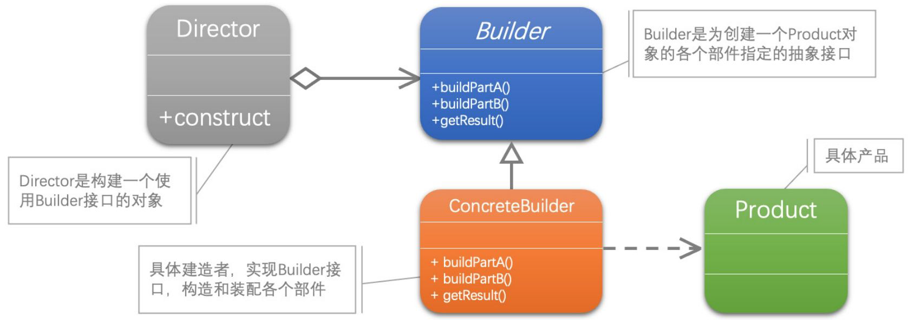

[1]: https://github.com/ruanrunxue/Practice-Design-Pattern--Go-Implementation/blob/main/docs/go_practice_design_pattern__builder.md
[2]: https://github.com/hzgaoshichao/playwithdesignpattern/tree/main/chapter13
[3]: https://design-patterns.readthedocs.io/zh-cn/latest/creational_patterns/builder.html
[4]: https://book.douban.com/subject/36116620/
[5]: https://design-patterns.readthedocs.io/zh-cn/latest/index.html
[6]: https://100go.co/#not-using-the-functional-options-pattern-11
## 关于
**大话设计模式 Golang 版** 是将 [<<大话设计模式【Java溢彩加强版】(作者:程杰)>>][4] 里面的 Java 代码用 Golang 重新写了一遍, 然后结合 [图说设计模式][5] 做总结归纳

## 简述
建造者模式 (Builder Pattern)：将一个复杂对象的构建与它的表示分离，使得同样的构建过程可以创建不同的表示。

建造者模式是一步一步创建一个复杂的对象，它允许用户只通过指定复杂对象的类型和内容就可以构建它们，用户不需要知道内部的具体构建细节。建造者模式属于对象创建型模式。根据中文翻译的不同，建造者模式又可以称为生成器模式。

建造者模式的一个常用应用就是 **链式调用**。
比如创建对象时需要长长的参数列表：
`persion := Person{name: "李鸿章", age: 20, gender: "Male", address: "中国南京"}`

使用建造者模式后可以链式调用：
```go
	person := pb.NewPersonBuilder().
		WithName("李鸿章").
		WithAge(20).
		WithGender("Male").
		WithAddress("中国南京").
		Build()
```

推荐阅读： [【Go实现】实践GoF的23种设计模式：建造者模式][2]
这篇文章将建造者模式讲解的更加的易于理解

## UML 结构
下面的 UML 图是原书中使用 Java 的 UML 图, 由于 Golang 中没有抽象类, 所以在代码实现时需要将 Java 中的抽象类转换为接口来实现




- Director 和 Builder 是一种聚合关系 (aggregation)，用一条带空心菱形箭头的直线表示；
- ConcreteBuilder 和 Product 是一种依赖关系 (dependency)，用一条带箭头的虚线表示；

**聚合关系 (aggregation)**  
聚合关系用一条带空心菱形箭头的直线表示，如上图表示 Builder 聚合到 Director 上，或者说 Director 由 Builder 组成；

聚合关系用于表示实体对象之间的关系，表示整体由部分构成的语义, 表示一种弱的 "拥有"关系, 体现的是A对象可以包含B对象, 但是B对象不是A对象的一部分；例如一个部门由多个员工组成；

与组合关系不同的是，整体和部分不是强依赖的，即使整体不存在了，部分仍然存在；例如， 部门撤销了，人员不会消失，他们依然存在；  

**依赖关系 (dependency)**
依赖关系是用一条带箭头的虚线表示的；如上图表示 ConcreteBuilder 依赖于 Product；他描述一个对象在运行期间会用到另一个对象的关系；
与关联关系不同的是，它是一种临时性的关系，通常在运行期间产生，并且随着运行时的变化； 依赖关系也可能发生变化；

显然，依赖也有方向，双向依赖是一种非常糟糕的结构，我们总是应该保持单向依赖，杜绝双向依赖的产生；

注：在最终代码中，依赖关系体现为类构造方法及类方法的传入参数，箭头的指向为调用关系；依赖关系除了临时知道对方外，还是“使用”对方的方法和属性；

## 代码实现
**源码下载地址**: [github.com/chapter13/][2]


## 典型应用场景
在以下情况下可以使用建造者模式：

- 需要生成的产品对象有复杂的内部结构，这些产品对象通常包含多个成员属性。
- 需要生成的产品对象的属性相互依赖，需要指定其生成顺序。
- 对象的创建过程独立于创建该对象的类。在建造者模式中引入了指挥者类，将创建过程封装在指挥者类中，而不在建造者类中。
- 隔离复杂对象的创建和使用，并使得相同的创建过程可以创建不同的产品。

## 优缺点
### 优点
- 在建造者模式中， 客户端不必知道产品内部组成的细节，将产品本身与产品的创建过程解耦，使得相同的创建过程可以创建不同的产品对象。
- 每一个具体建造者都相对独立，而与其他的具体建造者无关，因此可以很方便地替换具体建造者或增加新的具体建造者， 用户使用不同的具体建造者即可得到不同的产品对象 。
- 可以更加精细地控制产品的创建过程 。将复杂产品的创建步骤分解在不同的方法中，使得创建过程更加清晰，也更方便使用程序来控制创建过程。
- 增加新的具体建造者无须修改原有类库的代码，指挥者类针对抽象建造者类编程，系统扩展方便，符合“开闭原则”。


### 缺点
- 建造者模式所创建的产品一般具有较多的共同点，其组成部分相似，如果产品之间的差异性很大，则不适合使用建造者模式，因此其使用范围受到一定的限制。
- 如果产品的内部变化复杂，可能会导致需要定义很多具体建造者类来实现这种变化，导致系统变得很庞大。

## 推荐阅读
下面这两篇文章介绍了使用建造者模式的注意事项，并且介绍了函数式选项模式的使用。
1. [100 个 Go 语言典型错误：Not using the functional options pattern][6]
2.  [【Go实现】实践GoF的23种设计模式：建造者模式][2]

## 参考链接
- [图说设计模式: https://design-patterns.readthedocs.io/][3]
