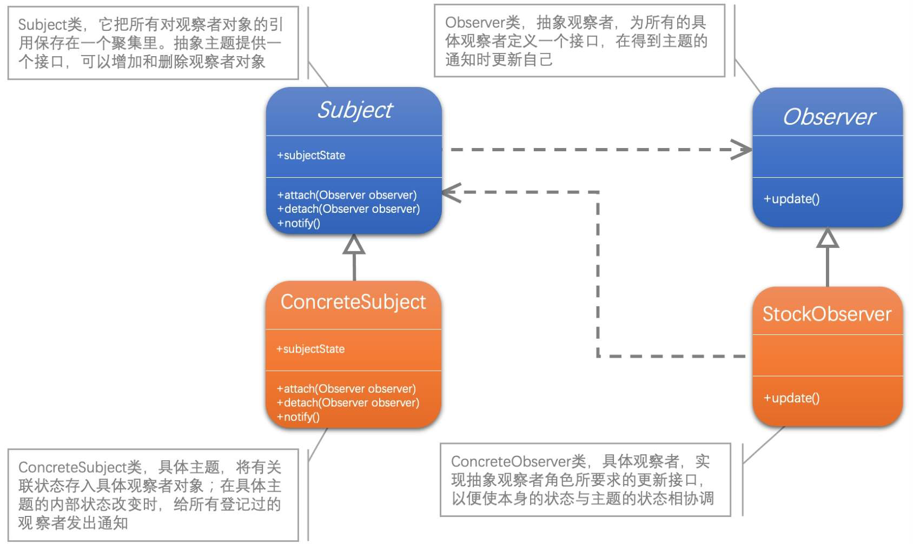

[1]: https://juejin.cn/post/6844903703447765005
[2]: https://github.com/hzgaoshichao/playwithdesignpattern/tree/main/chapter14
[3]: https://design-patterns.readthedocs.io/zh-cn/latest/behavioral_patterns/observer.html
[4]: https://book.douban.com/subject/36116620/
[5]: https://design-patterns.readthedocs.io/zh-cn/latest/index.html
## 关于
**大话设计模式 Golang 版** 是将 [<<大话设计模式【Java溢彩加强版】(作者:程杰)>>][4] 里面的 Java 代码用 Golang 重新写了一遍, 然后结合 [图说设计模式][5] 做总结归纳

## 简述
观察者模式(Observer Pattern)：定义对象间的一种一对多依赖关系，使得每当一个对象状态发生改变时，其相关依赖对象皆得到通知并被自动更新。观察者模式又叫做发布-订阅（Publish/Subscribe）模式

建立一种对象与对象之间的依赖关系，一个对象发生改变时将自动通知其他对象，其他对象将相应做出反应。在此，发生改变的对象称为观察目标，而被通知的对象称为观察者，一个观察目标可以对应多个观察者，而且这些观察者之间没有相互联系，可以根据需要增加和删除观察者，使得系统更易于扩展，这就是观察者模式的模式动机。

## UML 结构
下面的 UML 图是原书中使用 Java 的 UML 图, 由于 Golang 中没有抽象类, 所以在代码实现时需要将 Java 中的抽象类转换为接口来实现

- Subject 和 Observer 是一种依赖关系 (dependency)，用一条带箭头的虚线表示；

**依赖关系 (dependency)**  
依赖关系 (dependency) 依赖关系是用一条带箭头的虚线表示的；如上图表示 Subject 依赖于 Observer；他描述一个对象在运行期间会用到另一个对象的关系； 与关联关系不同的是，它是一种临时性的关系，通常在运行期间产生，并且随着运行时的变化； 依赖关系也可能发生变化；

显然，依赖也有方向，双向依赖是一种非常糟糕的结构，我们总是应该保持单向依赖，杜绝双向依赖的产生；

注：在最终代码中，依赖关系体现为类构造方法及类方法的传入参数，箭头的指向为调用关系；依赖关系除了临时知道对方外，还是“使用”对方的方法和属性； 

## 代码实现
**源码下载地址**: [github.com/chapter14/][2]

## 典型应用场景
在以下情况下可以使用观察者模式：

- 一个抽象模型有两个方面，其中一个方面依赖于另一个方面。将这些方面封装在独立的对象中使它们可以各自独立地改变和复用。
- 一个对象的改变将导致其他一个或多个对象也发生改变，而不知道具体有多少对象将发生改变，可以降低对象之间的耦合度。
- 一个对象必须通知其他对象，而并不知道这些对象是谁。
- 需要在系统中创建一个触发链，A对象的行为将影响B对象，B对象的行为将影响C对象……，可以使用观察者模式创建一种链式触发机制。

## 优缺点
### 优点
- 观察者模式所做的工作其实就是在解除耦合。让耦合的双方都依赖于抽象，而不是依赖于具体。从而使得各自的变化都不会影响另一边的变化。
- 观察者模式在观察目标和观察者之间建立一个抽象的耦合。
- 观察者模式支持广播通信。
- 观察者模式符合“开闭原则”的要求。

### 缺点
观察者模式的缺点
- 如果一个观察目标对象有很多直接和间接的观察者的话，将所有的观察者都通知到会花费很多时间。
- 如果在观察者和观察目标之间有循环依赖的话，观察目标会触发它们之间进行循环调用，可能导致系统崩溃。

## 参考链接
- [图说设计模式: https://design-patterns.readthedocs.io/][3]
