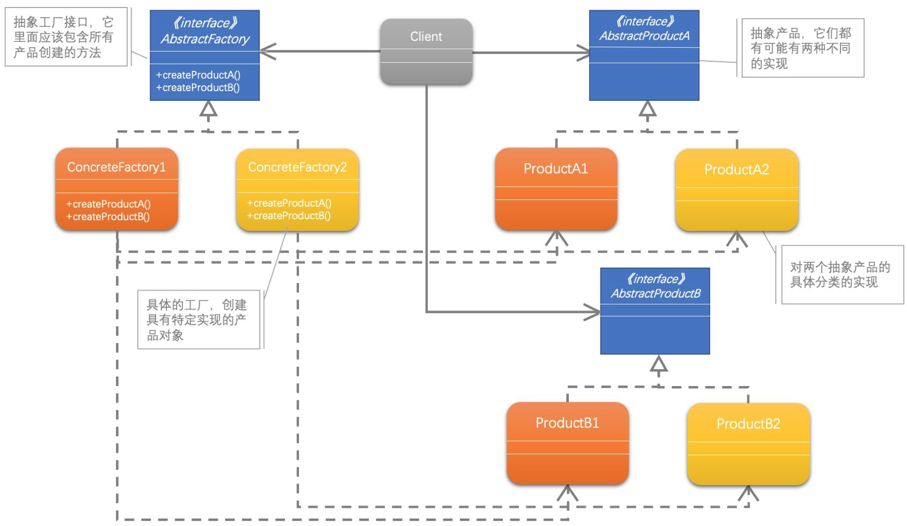
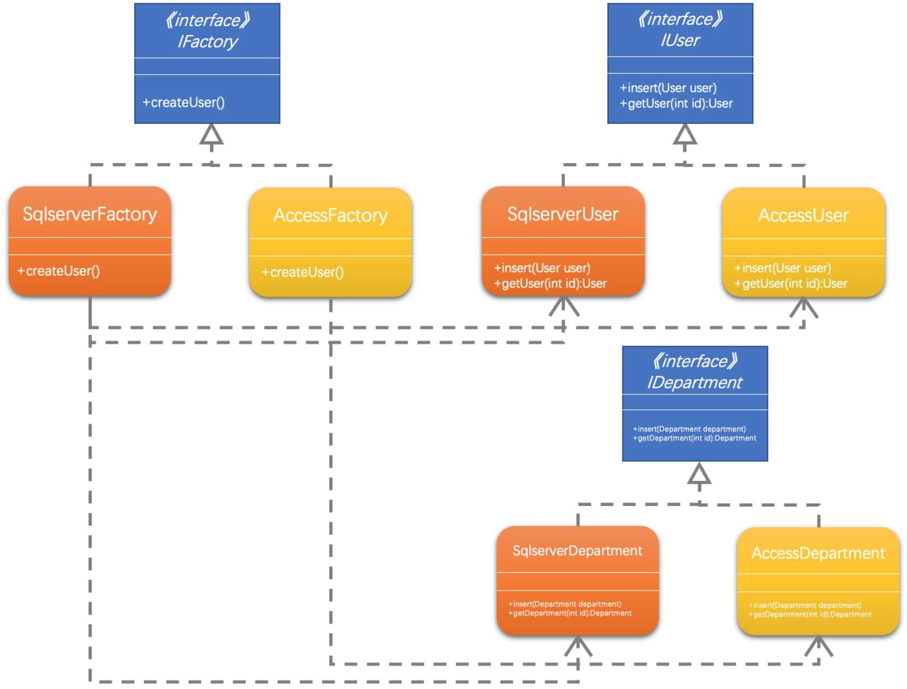

[1]: https://juejin.cn/post/6844903703447765005
[2]: https://github.com/hzgaoshichao/playwithdesignpattern/tree/main/chapter15
[3]: https://design-patterns.readthedocs.io/zh-cn/latest/creational_patterns/abstract_factory.html
[4]: https://book.douban.com/subject/36116620/
[5]: https://design-patterns.readthedocs.io/zh-cn/latest/index.html
## 关于
**大话设计模式 Golang 版** 是将 [<<大话设计模式【Java溢彩加强版】(作者:程杰)>>][4] 里面的 Java 代码用 Golang 重新写了一遍, 然后结合 [图说设计模式][5] 做总结归纳

## 描述
### 定义
抽象工厂模式 (Abstract Factory Pattern)：提供一个创建一系列相关或相互依赖对象的接口，而无须指定它们具体的类。

### 模式动机
在工厂方法模式中具体工厂负责生产具体的产品，每一个具体工厂对应一种具体产品，工厂方法也具有唯一性，一般情况下，一个具体工厂中只有一个工厂方法或者一组重载的工厂方法。但是有时候我们需要一个工厂可以提供多个产品对象，而不是单一的产品对象。

为了更清晰地理解工厂方法模式，需要先引入两个概念：

- **产品等级结构** ：产品等级结构即产品的继承结构，如一个抽象类是电视机，其子类有海尔电视机、海信电视机、TCL电视机，则抽象电视机与具体品牌的电视机之间构成了一个产品等级结构，抽象电视机是父类，而具体品牌的电视机是其子类。
- **产品族** ：在抽象工厂模式中，产品族是指由同一个工厂生产的，位于不同产品等级结构中的一组产品，如海尔电器工厂生产的海尔电视机、海尔电冰箱，海尔电视机位于电视机产品等级结构中，海尔电冰箱位于电冰箱产品等级结构中。

当系统所提供的工厂所需生产的具体产品并不是一个简单的对象，而是多个位于不同产品等级结构中属于不同类型的具体产品时需要使用抽象工厂模式。

抽象工厂模式是所有形式的工厂模式中最为抽象和最具一般性的一种形态。

抽象工厂模式与工厂方法模式最大的区别在于，工厂方法模式针对的是一个产品等级结构，而抽象工厂模式则需要面对多个产品等级结构，一个工厂等级结构可以负责多个不同产品等级结构中的产品对象的创建 。当一个工厂等级结构可以创建出分属于不同产品等级结构的一个产品族中的所有对象时，抽象工厂模式比工厂方法模式更为简单、有效率。

## UML 结构
下面的 UML 图是原书中使用 Java 的 UML 图, 由于 Golang 中没有抽象类, 所以在代码实现时需要将 Java 中的抽象类转换为接口来实现

- 带箭头的虚线表示依赖关系 (dependency)；
- 带箭头的实线表示关联关系 (association)；

**依赖关系 ( dependency )**

依赖关系 (dependency) 依赖关系是用一条带箭头的虚线表示的；如上图表示 `ConcreteFactory1` 依赖于 `ProductA1`；他描述一个对象在运行期间会用到另一个对象的关系； 与关联关系不同的是，它是一种临时性的关系，通常在运行期间产生，并且随着运行时的变化； 依赖关系也可能发生变化；

显然，依赖也有方向，双向依赖是一种非常糟糕的结构，我们总是应该保持单向依赖，杜绝双向依赖的产生；

注：在最终代码中，依赖关系体现为类构造方法及类方法的传入参数，箭头的指向为调用关系；依赖关系除了临时知道对方外，还是“使用”对方的方法和属性；

**关联关系 ( association )**

关联关系是用一条直线表示的；它描述不同类的对象之间的结构关系；它是一种静态关系， 通常与运行状态无关，一般由常识等因素决定的；它一般用来定义对象之间静态的、天然的结构； 所以，关联关系是一种“强关联”的关系；

比如，乘车人和车票之间就是一种关联关系；学生和学校就是一种关联关系；

关联关系默认不强调方向，表示对象间相互知道；如果特别强调方向，如上图中，表示 `Client` 知道`AbstractFactory`、`AbstractProductA` 和 `AbstractProductB`，但`AbstractFactory`、`AbstractProductA` 和 `AbstractProductB`不知道`Client`；

注：在最终代码中，关联对象通常是以`成员变量`的形式实现的；

## 代码实现
示例代码 UML 图：

**源码下载地址**: [github.com/chapter15/][2]

## 典型应用场景
在以下情况下可以使用抽象工厂模式：

- 一个系统不应当依赖于产品类实例如何被创建、组合和表达的细节，这对于所有类型的工厂模式都是重要的。
- 系统中有多于一个的产品族，而每次只使用其中某一产品族。
- 属于同一个产品族的产品将在一起使用，这一约束必须在系统的设计中体现出来。
- 系统提供一个产品类的库，所有的产品以同样的接口出现，从而使客户端不依赖于具体实现。

## 优缺点
### 优点
- 抽象工厂模式隔离了具体类的生成，使得客户并不需要知道什么被创建。由于这种隔离，更换一个具体工厂就变得相对容易。所有的具体工厂都实现了抽象工厂中定义的那些公共接口，因此只需改变具体工厂的实例，就可以在某种程度上改变整个软件系统的行为。另外，应用抽象工厂模式可以实现高内聚低耦合的设计目的，因此抽象工厂模式得到了广泛的应用。
- 当一个产品族中的多个对象被设计成一起工作时，它能够保证客户端始终只使用同一个产品族中的对象。这对一些需要根据当前环境来决定其行为的软件系统来说，是一种非常实用的设计模式。
- 增加新的具体工厂和产品族很方便，无须修改已有系统，符合“开闭原则”。

### 缺点
- 在添加新的产品对象时，难以扩展抽象工厂来生产新种类的产品，这是因为在抽象工厂角色中规定了所有可能被创建的产品集合，要支持新种类的产品就意味着要对该接口进行扩展，而这将涉及到对抽象工厂角色及其所有子类的修改，显然会带来较大的不便。
- 开闭原则的倾斜性（增加新的工厂和产品族容易，增加新的产品等级结构麻烦）。增加新的产品等级结构意味着下雨要修改 `AbstracFactory` 这个接口，修改接口意味着需要修改已经存在的实现。

## 模式扩展
### “开闭原则”的倾斜性
“开闭原则”要求系统对扩展开放，对修改封闭，通过扩展达到增强其功能的目的。对于涉及到多个产品族与多个产品等级结构的系统，其功能增强包括两方面：

- 增加产品族：对于增加新的产品族，工厂方法模式很好的支持了“开闭原则”，对于新增加的产品族，只需要对应增加一个新的具体工厂即可，对已有代码无须做任何修改。
- 增加新的产品等级结构：对于增加新的产品等级结构，需要修改所有的工厂角色，包括抽象工厂类，在所有的工厂类中都需要增加生产新产品的方法，不能很好地支持“开闭原则”。

抽象工厂模式的这种性质称为“开闭原则”的倾斜性，抽象工厂模式以一种倾斜的方式支持增加新的产品，它为新产品族的增加提供方便，但不能为新的产品等级结构的增加提供这样的方便。
### 工厂模式的退化
当抽象工厂模式中每一个具体工厂类只创建一个产品对象，也就是只存在一个产品等级结构时，抽象工厂模式退化成工厂方法模式；当工厂方法模式中抽象工厂与具体工厂合并，提供一个统一的工厂来创建产品对象，并将创建对象的工厂方法设计为静态方法时，工厂方法模式退化成简单工厂模式。
## 参考链接
- [图说设计模式: https://design-patterns.readthedocs.io/][3]
