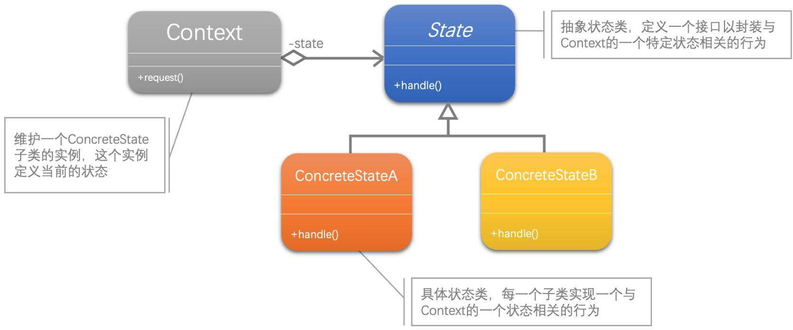
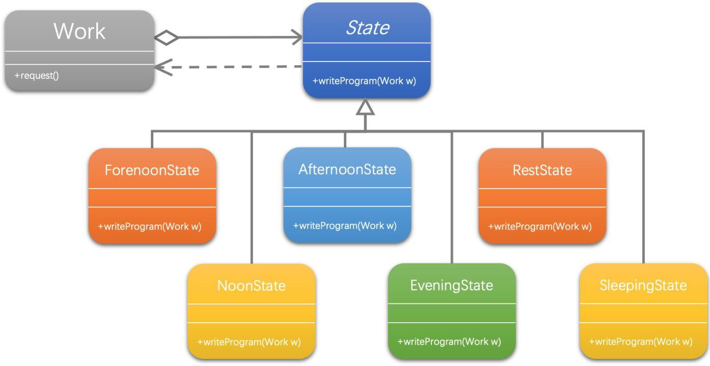

[1]: https://juejin.cn/post/6844903703447765005
[2]: https://github.com/hzgaoshichao/playwithdesignpattern/tree/main/chapter16
[3]: https://design-patterns.readthedocs.io/zh-cn/latest/behavioral_patterns/state.html
[4]: https://book.douban.com/subject/36116620/
[5]: https://design-patterns.readthedocs.io/zh-cn/latest/index.html
## 关于
**大话设计模式 Golang 版** 是将 [<<大话设计模式【Java溢彩加强版】(作者:程杰)>>][4] 里面的 Java 代码用 Golang 重新写了一遍, 然后结合 [图说设计模式][5] 做总结归纳

## 描述
### 定义
状态模式 (State Pattern) ：允许一个对象在其内部状态改变时改变它的行为，对象看起来似乎修改了它的类。

### 模式动机
在很多情况下，一个对象的行为取决于一个或多个动态变化的属性，这样的属性叫做状态，这样的对象叫做有状态的(stateful)对象，这样的对象状态是从事先定义好的一系列值中取出的。当一个这样的对象与外部事件产生互动时，其内部状态就会改变，从而使得系统的行为也随之发生变化

## UML 结构
下面的 UML 图是原书中使用 Java 的 UML 图, 由于 Golang 中没有抽象类, 所以在代码实现时需要将 Java 中的抽象类转换为接口来实现

- 状态模式包含三个角色：环境类（Context）又称为上下文类，它是拥有状态的对象，在环境类中维护一个抽象状态类State的实例，这个实例定义当前状态，在具体实现时，它是一个State子类的对象，可以定义初始状态；抽象状态类用于定义一个接口以封装与环境类的一个特定状态相关的行为；具体状态类是抽象状态类的子类，每一个子类实现一个与环境类的一个状态相关的行为，每一个具体状态类对应环境的一个具体状态，不同的具体状态类其行为有所不同。
- 带空心菱形箭头的直线表示聚合关系 (aggregation)；

**聚合关系 (aggregation)**

聚合关系用一条带空心菱形箭头的直线表示，如上图表示 State 聚合到 Context 上，或者说 Context 由 State 组成；

聚合关系用于表示实体对象之间的关系，表示整体由部分构成的语义, 表示一种弱的 "拥有"关系, 体现的是A对象可以包含B对象, 但是B对象不是A对象的一部分；例如一个部门由多个员工组成；

与组合关系不同的是，整体和部分不是强依赖的，即使整体不存在了，部分仍然存在；例如， 部门撤销了，人员不会消失，他们依然存在

## 代码实现
示例代码 UML 图：

- 带空心菱形箭头的直线表示聚合关系 (aggregation)；
- 带箭头的虚线表示依赖关系 (dependency)；

**依赖关系 ( dependency )**

依赖关系 (dependency) 依赖关系是用一条带箭头的虚线表示的；如上图表示 State 依赖于 Work；他描述一个对象在运行期间会用到另一个对象的关系； 与关联关系不同的是，它是一种临时性的关系，通常在运行期间产生，并且随着运行时的变化； 依赖关系也可能发生变化；

显然，依赖也有方向，双向依赖是一种非常糟糕的结构，我们总是应该保持单向依赖，杜绝双向依赖的产生；

注：在最终代码中，依赖关系体现为类构造方法及类方法的传入参数，箭头的指向为调用关系；依赖关系除了临时知道对方外，还是“使用”对方的方法和属性；

**源码下载地址**: [github.com/chapter16/][2]

## 典型应用场景
在以下情况下可以使用状态模式：

- 对象的行为依赖于它的状态（属性）并且可以根据它的状态改变而改变它的相关行为。
- 代码中包含大量与对象状态有关的条件语句，这些条件语句的出现，会导致代码的可维护性和灵活性变差，不能方便地增加和删除状态，使客户类与类库之间的耦合增强。在这些条件语句中包含了对象的行为，而且这些条件对应于对象的各种状态。

## 优缺点
### 优点
- 封装了转换规则。
- 枚举可能的状态，在枚举状态之前需要确定状态种类。
- 将所有与某个状态有关的行为放到一个类中，并且可以方便地增加新的状态，只需要改变对象状态即可改变对象的行为。
- 允许状态转换逻辑与状态对象合成一体，而不是某一个巨大的条件语句块。
- 可以让多个环境对象共享一个状态对象，从而减少系统中对象的个数。

### 缺点
- 状态模式的使用必然会增加系统类和对象的个数。
- 状态模式的结构与实现都较为复杂，如果使用不当将导致程序结构和代码的混乱。
- 状态模式对“开闭原则”的支持并不太好，对于可以切换状态的状态模式，增加新的状态类需要修改那些负责状态转换的源代码，否则无法切换到新增状态；而且修改某个状态类的行为也需修改对应类的源代码。

##  模式应用
状态模式在工作流或游戏等类型的软件中得以广泛使用，甚至可以用于这些系统的核心功能设计，如在政府OA办公系统中，一个批文的状态有多种：尚未办理；正在办理；正在批示；正在审核；已经完成等各种状态，而且批文状态不同时对批文的操作也有所差异。使用状态模式可以描述工作流对象（如批文）的状态转换以及不同状态下它所具有的行为。
## 参考链接
- [图说设计模式: https://design-patterns.readthedocs.io/][3]
