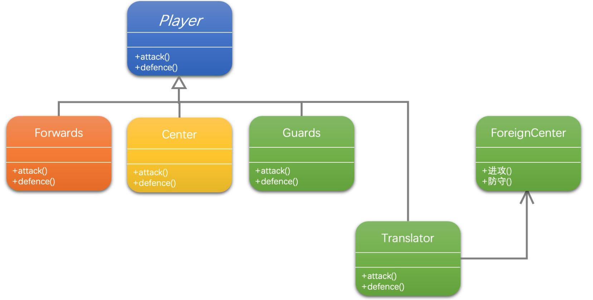

[1]: https://juejin.cn/post/6844903703447765005
[2]: https://github.com/hzgaoshichao/playwithdesignpattern/tree/main/chapter17
[3]: https://design-patterns.readthedocs.io/zh-cn/latest/structural_patterns/adapter.html
[4]: https://book.douban.com/subject/36116620/
[5]: https://design-patterns.readthedocs.io/zh-cn/latest/index.html
## 关于
**大话设计模式 Golang 版** 是将 [<<大话设计模式【Java溢彩加强版】(作者:程杰)>>][4] 里面的 Java 代码用 Golang 重新写了一遍, 然后结合 [图说设计模式][5] 做总结归纳

## 描述
### 定义
适配器模式 (Adapter Pattern) ：将一个接口转换成客户希望的另一个接口，适配器模式使接口不兼容的那些类可以一起工作，其别名为包装器(Wrapper)。

### 模式动机
- 在软件开发中采用类似于电源适配器的设计和编码技巧被称为适配器模式。
- 通常情况下，客户端可以通过目标类的接口访问它所提供的服务。有时，现有的类可以满足客户类的功能需要，但是它所提供的接口不一定是客户类所期望的，这可能是因为现有类中方法名与目标类中定义的方法名不一致等原因所导致的。
- 在这种情况下，现有的接口需要转化为客户类期望的接口，这样保证了对现有类的重用。如果不进行这样的转化，客户类就不能利用现有类所提供的功能，适配器模式可以完成这样的转化。
- 在适配器模式中可以定义一个包装类，包装不兼容接口的对象，这个包装类指的就是适配器(Adapter)，它所包装的对象就是适配者(Adaptee)，即被适配的类。
- 适配器提供客户类需要的接口，适配器的实现就是把客户类的请求转化为对适配者的相应接口的调用。也就是说：当客户类调用适配器的方法时，在适配器类的内部将调用适配者类的方法，而这个过程对客户类是透明的，客户类并不直接访问适配者类。因此，适配器可以使由于接口不兼容而不能交互的类可以一起工作。这就是适配器模式的模式动机。

## UML 结构
下面的 UML 图是原书中使用 Java 的 UML 图, 由于 Golang 中没有抽象类, 所以在代码实现时需要将 Java 中的抽象类转换为接口来实现

- 带箭头的实线表示关联关系 (association)；

**关联关系 ( association )**

关联关系是用一条直线表示的；它描述不同类的对象之间的结构关系；它是一种静态关系， 通常与运行状态无关，一般由常识等因素决定的；它一般用来定义对象之间静态的、天然的结构； 所以，关联关系是一种“强关联”的关系；

比如，乘车人和车票之间就是一种关联关系；学生和学校就是一种关联关系；

关联关系默认不强调方向，表示对象间相互知道；如果特别强调方向，如上图中，表示 Client 知道 Target，但Target 不知道 Client；

注：在最终代码中，关联对象通常是以成员变量的形式实现的；

## 代码实现
示例代码 UML 图：

**源码下载地址**: [github.com/chapter17/][2]

## 典型应用场景
在以下情况下可以使用适配器模式：

- 系统需要使用现有的类，而这些类的接口不符合系统的需要。
- 想要建立一个可以重复使用的类，用于与一些彼此之间没有太大关联的一些类，包括一些可能在将来引进的类一起工作。

## 优缺点

- 将目标类和适配者类解耦，通过引入一个适配器类来重用现有的适配者类，而无须修改原有代码。
- 增加了类的透明性和复用性，将具体的实现封装在适配者类中，对于客户端类来说是透明的，而且提高了适配者的复用性。
- 灵活性和扩展性都非常好，通过使用配置文件，可以很方便地更换适配器，也可以在不修改原有代码的基础上增加新的适配器类，完全符合“开闭原则”。
- 一个对象适配器可以把多个不同的适配者适配到同一个目标，也就是说，同一个适配器可以把适配者类和它的子类都适配到目标接口。

##  模式应用
状态模式在工作流或游戏等类型的软件中得以广泛使用，甚至可以用于这些系统的核心功能设计，如在政府OA办公系统中，一个批文的状态有多种：尚未办理；正在办理；正在批示；正在审核；已经完成等各种状态，而且批文状态不同时对批文的操作也有所差异。使用状态模式可以描述工作流对象（如批文）的状态转换以及不同状态下它所具有的行为。
## 参考链接
- [图说设计模式: https://design-patterns.readthedocs.io/][3]
