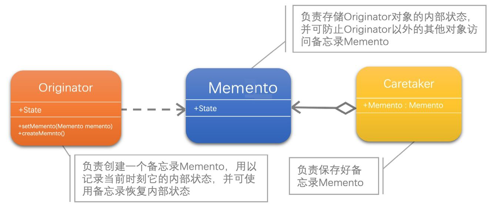
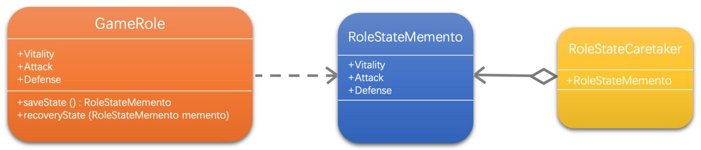

[1]: https://juejin.cn/post/6844903703447765005
[2]: https://github.com/hzgaoshichao/playwithdesignpattern/tree/main/chapter18
[3]: https://design-patterns.readthedocs.io/zh-cn/latest/structural_patterns/adapter.html
[4]: https://book.douban.com/subject/36116620/
[5]: https://design-patterns.readthedocs.io/zh-cn/latest/index.html
## 关于
**大话设计模式 Golang 版** 是将 [<<大话设计模式【Java溢彩加强版】(作者:程杰)>>][4] 里面的 Java 代码用 Golang 重新写了一遍, 然后结合 [图说设计模式][5] 做总结归纳

## 描述
### 定义
备忘录 （Memento）： 在不破坏封装性的前提下，捕获一个对象的内部状态，并在该对象之外保存这个状态。这样以后就可将该对象恢复到原先保存的状态。

## UML 结构
下面的 UML 图是原书中使用 Java 的 UML 图, 由于 Golang 中没有抽象类, 所以在代码实现时需要将 Java 中的抽象类转换为接口来实现
- **Originator（发起人）**：负责创建一个备忘录Memento，用以记录当前时刻它的内部状态，并可使用备忘录恢复内部状态。Originator可根据需要决定Memento存储Originator的哪些内部状态。
- **Memento（备忘录）**：负责存储Originator对象的内部状态，并可防止Originator以外的其他对象访问备忘录Memento。备忘录有两个接口，Caretaker只能看到备忘录的窄接口，它只能将备忘录传递给其他对象。Originator能够看到一个宽接口，允许它访问返回到先前状态所需的所有数据。
- **Caretaker（管理者）**：负责保存好备忘录Memento，不能对备忘录的内容进行操作或检查。

- 带空心菱形箭头的直线表示聚合关系 (aggregation)
- 带箭头的虚线表示依赖关系 (dependency)；

**聚合关系 (aggregation)**

聚合关系用一条带空心菱形箭头的直线表示，如上图表示 Memento 聚合到 Caretaker 上，或者说 Caretaker 由 Memento 组成；

聚合关系用于表示实体对象之间的关系，表示整体由部分构成的语义, 表示一种弱的 "拥有"关系, 体现的是A对象可以包含B对象, 但是B对象不是A对象的一部分；例如一个部门由多个员工组成；

与组合关系不同的是，整体和部分不是强依赖的，即使整体不存在了，部分仍然存在；例如， 部门撤销了，人员不会消失，他们依然存在

**依赖关系 ( dependency )**

依赖关系 (dependency) 依赖关系是用一条带箭头的虚线表示的；如上图表示 Originator 依赖于 Memento；他描述一个对象在运行期间会用到另一个对象的关系； 与关联关系不同的是，它是一种临时性的关系，通常在运行期间产生，并且随着运行时的变化； 依赖关系也可能发生变化；

显然，依赖也有方向，双向依赖是一种非常糟糕的结构，我们总是应该保持单向依赖，杜绝双向依赖的产生；

注：在最终代码中，依赖关系体现为类构造方法及类方法的传入参数，箭头的指向为调用关系；依赖关系除了临时知道对方外，还是“使用”对方的方法和属性；

## 代码实现
示例代码 UML 图：

**源码下载地址**: [github.com/chapter18/][2]

## 典型应用场景
在以下情况下可以使用适配器模式：

- Memento模式比较适用于功能比较复杂的，但需要维护或记录属性历史的类，或者需要保存的属性只是众多属性中的一小部分时，Originator可以根据保存的Memento信息还原到前一状态。
- 如果在某个系统中使用命令模式时，需要实现命令的撤销功能，那么命令模式可以使用备忘录模式来存储可撤销操作的状态

## 优缺点
### 优点
- 有时一些对象的内部信息必须保存在对象以外的地方，但是必须要由对象自己读取，这时，使用备忘录可以把复杂的对象内部信息对其他的对象屏蔽起来，从而可以恰当地保持封装的边界
- 在当角色的状态改变的时候，有可能这个状态无效，这时候就可以使用暂时存储起来的备忘录将状态复原

### 缺点
- 角色状态需要完整存储到备忘录对象中，如果状态数据很大很多，那么在资源消耗上，备忘录对象会非常耗内存。
