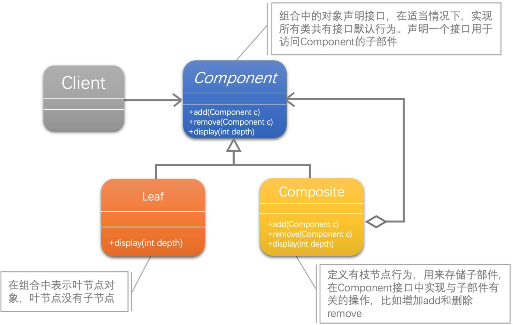
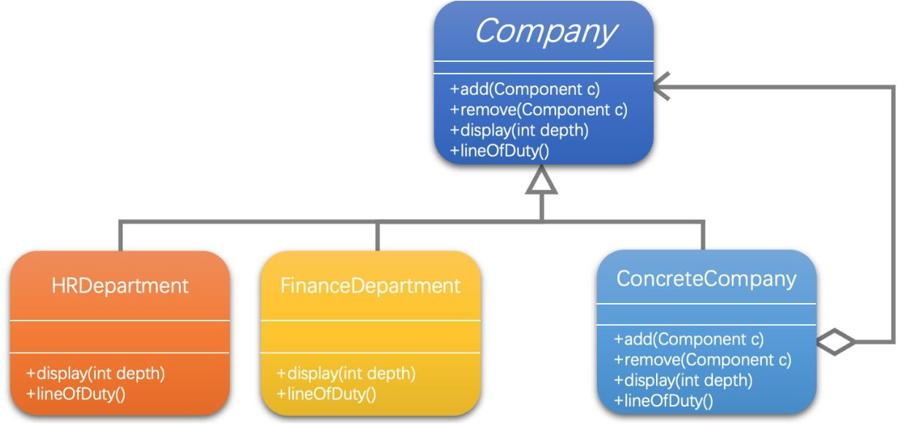

[1]: https://juejin.cn/post/6844903703447765005
[2]: https://github.com/hzgaoshichao/playwithdesignpattern/tree/main/chapter19
[3]: https://design-patterns.readthedocs.io/zh-cn/latest/structural_patterns/adapter.html
[4]: https://book.douban.com/subject/36116620/
[5]: https://design-patterns.readthedocs.io/zh-cn/latest/index.html
## 关于
**大话设计模式 Golang 版** 是将 [<<大话设计模式【Java溢彩加强版】(作者:程杰)>>][4] 里面的 Java 代码用 Golang 重新写了一遍, 然后结合 [图说设计模式][5] 做总结归纳

## 描述
### 定义
组合模式（Composite），将对象组合成树形结构以表示'部分-整体'的层次结构。组合模式使得用户对单个对象和组合对象的使用具有一致性。

## UML 结构
下面的 UML 图是原书中使用 Java 的 UML 图, 由于 Golang 中没有抽象类, 所以在代码实现时需要将 Java 中的抽象类转换为接口来实现

- 带空心菱形箭头的直线表示聚合关系 (aggregation)
- 带箭头的实线表示关联关系 (association)；

**聚合关系 (aggregation)**

聚合关系用一条带空心菱形箭头的直线表示，如上图表示 Component 聚合到 Composite 上，或者说 Composite 由 Component 组成；

聚合关系用于表示实体对象之间的关系，表示整体由部分构成的语义, 表示一种弱的 "拥有"关系, 体现的是A对象可以包含B对象, 但是B对象不是A对象的一部分；例如一个部门由多个员工组成；

与组合关系不同的是，整体和部分不是强依赖的，即使整体不存在了，部分仍然存在；例如， 部门撤销了，人员不会消失，他们依然存在

**关联关系 ( association )**

关联关系是用一条直线表示的；它描述不同类的对象之间的结构关系；它是一种静态关系， 通常与运行状态无关，一般由常识等因素决定的；它一般用来定义对象之间静态的、天然的结构； 所以，关联关系是一种“强关联”的关系；

比如，乘车人和车票之间就是一种关联关系；学生和学校就是一种关联关系；

关联关系默认不强调方向，表示对象间相互知道；如果特别强调方向，如上图中，表示 Client 知道 Component，Component 不知道 Client；

注：在最终代码中，关联对象通常是以成员变量的形式实现的；

## 代码实现
示例代码 UML 图：

**源码下载地址**: [github.com/chapter19/][2]

## 典型应用场景
在以下情况下可以使用适配器模式：

- 当你发现需求中是体现部分与整体层次的结构时，以及你希望用户可以忽略组合对象与单个对象的不同，统一地使用组合结构中的所有对象时，就应该考虑用组合模式了

## 优缺点

- 像上面示例中组合模式这样就定义了包含人力资源部和财务部这些基本对象和分公司、办事处等组合对象的类层次结构。基本对象可以被组合成更复杂的组合对象，而这个组合对象又可以被组合，这样不断地`递归`下去，客户代码中，任何用到基本对象的地方都可以使用组合对象了。
- 用户是不用关心到底是处理一个叶节点还是处理一个组合组件，也就用不着为定义组合而写一些选择判断语句了。简单点说，就是组合模式让客户可以一致地使用组合结构和单个对象。
