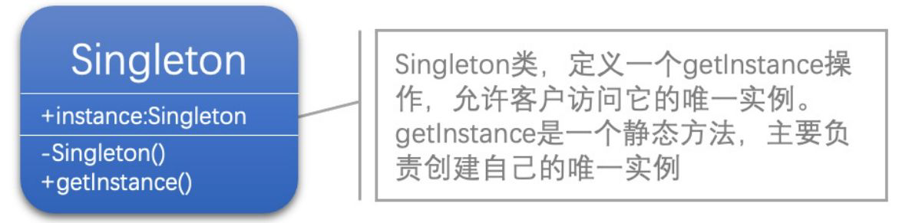

[1]: https://www.liwenzhou.com/posts/Go/singleton/
[2]: https://github.com/hzgaoshichao/playwithdesignpattern/tree/main/chapter21
[3]: https://design-patterns.readthedocs.io/zh-cn/latest/creational_patterns/singleton.html
[4]: https://book.douban.com/subject/36116620/
[5]: https://design-patterns.readthedocs.io/zh-cn/latest/index.html
[6]: https://100go.co/#not-understanding-race-problems-data-races-vs-race-conditions-and-the-go-memory-model-58
## 关于
**大话设计模式 Golang 版** 是将 [<<大话设计模式【Java溢彩加强版】(作者:程杰)>>][4] 里面的 Java 代码用 Golang 重新写了一遍, 然后结合 [图说设计模式][5] 做总结归纳

介绍 Golang 单例模式比较好的博客文章：[Go语言中的单例模式][1]

## 描述
### 定义
单例模式 (Singleton Pattern)：单例模式确保某一个类只有一个实例，而且自行实例化并向整个系统提供这个实例，这个类称为单例类，它提供全局访问的方法。

### 模式动机
- 对于系统中的某些类来说，只有一个实例很重要，例如，一个系统中可以存在多个打印任务，但是只能有一个正在工作的任务；一个系统只能有一个窗口管理器或文件系统；一个系统只能有一个计时工具或ID（序号）生成器。
- 
- 如何保证一个类只有一个实例并且这个实例易于被访问呢？定义一个全局变量可以确保对象随时都可以被访问，但不能防止我们实例化多个对象。
- 
- 一个更好的解决办法是让类自身负责保存它的唯一实例。这个类可以保证没有其他实例被创建，并且它可以提供一个访问该实例的方法。这就是单例模式的模式动机。
## UML 结构
下面的 UML 图是原书中使用 Java 的 UML 图:



## 代码实现

**源码下载地址**: [github.com/chapter21/][2]

### Check-Lock-Check 模式
在C ++和其他语言中，确保最小程度的锁定并且仍然是并发安全的最佳和最安全的方法是在获取锁定时利用众所周知的Check-Lock-Check模式。该模式的伪代码表示如下。

```js
if check() {
    lock() {
        if check() {
            // 在这里执行加锁安全的代码
        }
    }
}

```
该模式背后的思想是，你应该首先进行检查，以最小化任何主动锁定，因为IF语句的开销要比加锁小。其次，我们希望等待并获取互斥锁，这样在同一时刻在那个块中只有一个执行。但是，在第一次检查和获取互斥锁之间，可能有其他goroutine获取了锁，因此，我们需要在锁的内部再次进行检查，以避免用另一个实例覆盖了实例。

如果将这种模式应用于我们的GetInstance()方法，我们会写出类似下面的代码：

```go
func GetInstance() *singleton {
    if instance == nil {     // 不太完美 因为这里不是完全原子的
        mu.Lock()
        defer mu.Unlock()

        if instance == nil {
            instance = &singleton{}
        }
    }
    return instance
}

```
通过使用sync/atomic这个包，我们可以原子化加载并设置一个标志，该标志表明我们是否已初始化实例。
```go
package singleton

import (
	"sync"
	"sync/atomic"
)

type singleton struct{}

var instance *singleton
var mu sync.Mutex

var initialized uint32

func GetInstance() *singleton {

	if atomic.LoadUint32(&initialized) == 1 { // 原子操作
		return instance
	}

	mu.Lock()
	defer mu.Unlock()

	if initialized == 0 {
		instance = &singleton{}
		atomic.StoreUint32(&initialized, 1)
	}

	return instance
}
```
但是……这看起来有点繁琐了，我们其实可以通过研究Go语言和标准库如何实现goroutine同步来做得更好。
### Go 语言惯用的单例模式
我们希望利用Go惯用的方式来实现这个单例模式。我们在标准库sync中找到了Once类型。它能保证某个操作仅且只执行一次。下面是来自Go标准库的源码（部分注释有删改）。
```go
// Once is an object that will perform exactly one action.
type Once struct {
	// done indicates whether the action has been performed.
	// It is first in the struct because it is used in the hot path.
	// The hot path is inlined at every call site.
	// Placing done first allows more compact instructions on some architectures (amd64/x86),
	// and fewer instructions (to calculate offset) on other architectures.
	done uint32
	m    Mutex
}

func (o *Once) Do(f func()) {
	if atomic.LoadUint32(&o.done) == 0 { // check
		// Outlined slow-path to allow inlining of the fast-path.
		o.doSlow(f)
	}
}

func (o *Once) doSlow(f func()) {
	o.m.Lock()                          // lock
	defer o.m.Unlock()
	
	if o.done == 0 {                    // check
		defer atomic.StoreUint32(&o.done, 1)
		f()
	}
}

```
这说明我们可以借助这个实现只执行一次某个函数/方法，once.Do()的用法如下：

```go
once.Do(func() {
    // 在这里执行安全的初始化
})

```
下面就是单例实现的完整代码，该实现利用sync.Once类型去同步对GetInstance() 的访问，并确保我们的类型仅被初始化一次

```go
package singleton

import (
    "sync"
)

type singleton struct {}

var instance *singleton
var once sync.Once

func GetInstance() *singleton {
    once.Do(func() {
        instance = &singleton{}
    })
    return instance
}

```
因此，使用sync.Once包是安全地实现此目标的首选方式

## 典型应用场景
在以下情况下可以使用单例模式：

- 系统只需要一个实例对象，如系统要求提供一个唯一的序列号生成器，或者需要考虑资源消耗太大而只允许创建一个对象。
- 客户调用类的单个实例只允许使用一个公共访问点，除了该公共访问点，不能通过其他途径访问该实例。
- 在一个系统中要求一个类只有一个实例时才应当使用单例模式。反过来，如果一个类可以有几个实例共存，就需要对单例模式进行改进，使之成为多例模式

## 优缺点
### 优点
- 提供了对唯一实例的受控访问。因为单例类封装了它的唯一实例，所以它可以严格控制客户怎样以及何时访问它，并为设计及开发团队提供了共享的概念。
- 由于在系统内存中只存在一个对象，因此可以节约系统资源，对于一些需要频繁创建和销毁的对象，单例模式无疑可以提高系统的性能。
- 允许可变数目的实例。我们可以基于单例模式进行扩展，使用与单例控制相似的方法来获得指定个数的对象实例。
### 缺点
- 由于单例模式中没有抽象层，因此单例类的扩展有很大的困难。
- 单例类的职责过重，在一定程度上违背了“单一职责原则”。因为单例类既充当了工厂角色，提供了工厂方法，同时又充当了产品角色，包含一些业务方法，将产品的创建和产品的本身的功能融合到一起。
- 滥用单例将带来一些负面问题，如为了节省资源将数据库连接池对象设计为单例类，可能会导致共享连接池对象的程序过多而出现连接池溢出；现在很多面向对象语言(如Java、C#)的运行环境都提供了自动垃圾回收的技术，因此，如果实例化的对象长时间不被利用，系统会认为它是垃圾，会自动销毁并回收资源，下次利用时又将重新实例化，这将导致对象状态的丢失。
##  模式应用
一个具有自动编号主键的表可以有多个用户同时使用，但数据库中只能有一个地方分配下一个主键编号，否则会出现主键重复，因此该主键编号生成器必须具备唯一性，可以通过单例模式来实现。

## 操作原子化
在下面的 Check-Lock-Check 模式代码中， 为啥用 `if atomic.LoadUInt32(&initialized) == 1` 代替 `if instance == nil`， 让操作原子化呢？ 因为 `if instance == nil` 可能存在`数据竞争（data race）`. 当两个或多个 goroutine 同时访问同一个内存位置并且至少有一个正在写入时， 就会发生数据竞争（data race）。 下面代码可能存在同时对 instance 的读和写的情况。详细可以阅读 [100-go-mistakes][6]

```js
func GetInstance() *singleton {
    if instance == nil {     // 不太完美 因为这里不是完全原子的
        mu.Lock()
        defer mu.Unlock()

        if instance == nil {
            instance = &singleton{}
        }
    }
    return instance
}

```

## 参考链接
- [图说设计模式: https://design-patterns.readthedocs.io/][3]
- [李文周的博客: https://www.liwenzhou.com/posts/Go/singleton/][1]
