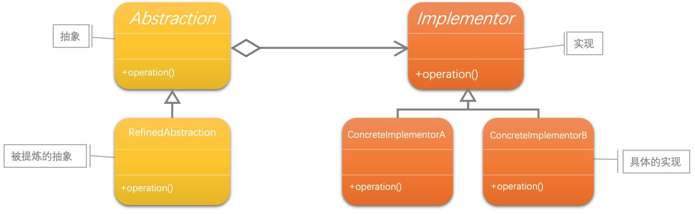
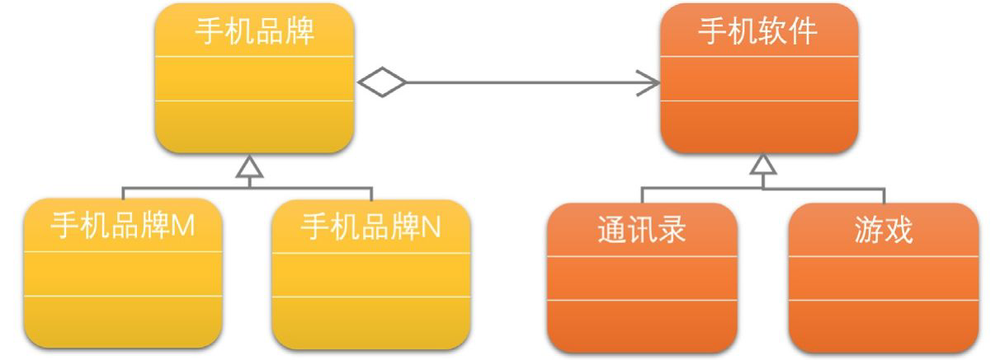

[1]: https://juejin.cn/post/6844903703447765005
[2]: https://github.com/hzgaoshichao/playwithdesignpattern/tree/main/chapter22
[3]: https://design-patterns.readthedocs.io/zh-cn/latest/structural_patterns/bridge.html
[4]: https://book.douban.com/subject/36116620/
[5]: https://design-patterns.readthedocs.io/zh-cn/latest/index.html
## 关于
**大话设计模式 Golang 版** 是将 [<<大话设计模式【Java溢彩加强版】(作者:程杰)>>][4] 里面的 Java 代码用 Golang 重新写了一遍, 然后结合 [图说设计模式][5] 做总结归纳

## 描述
### 定义
桥接模式 (Bridge Pattern)：将抽象部分与它的实现部分分离，使它们都可以独立地变化。

## UML 结构
下面的 UML 图是原书中使用 Java 的 UML 图, 由于 Golang 中没有抽象类, 所以在代码实现时需要将 Java 中的抽象类转换为接口来实现

桥接模式包含如下四个角色：   
- 抽象类中定义了一个实现类接口类型的对象并可以维护该对象；   
- 扩充抽象类扩充由抽象类定义的接口，它实现了在抽象类中定义的抽象业务方法，在扩充抽象类中可以调用在实现类接口中定义的业务方法；   
- 实现类接口定义了实现类的接口，实现类接口仅提供基本操作，而抽象类定义的接口可能会做更多更复杂的操作；  
- 具体实现类实现了实现类接口并且具体实现它，在不同的具体实现类中提供基本操作的不同实现，在程序运行时，具体实现类对象将替换其父类对象，提供给客户端具体的业务操作方法；   
- **两个抽象类之间有一个聚合线，像一座桥，所以这个设计模式就叫作'桥接模式'**

- 带空心菱形箭头的直线表示聚合关系 (aggregation)

**聚合关系 (aggregation)**

聚合关系用一条带空心菱形箭头的直线表示，如上图表示 Implementor 聚合到 Abstraction 上，或者说 Abstraction 由 Implementor 组成；

聚合关系用于表示实体对象之间的关系，表示整体由部分构成的语义, 表示一种弱的 "拥有"关系, 体现的是A对象可以包含B对象, 但是B对象不是A对象的一部分；例如一个部门由多个员工组成；

与组合关系不同的是，整体和部分不是强依赖的，即使整体不存在了，部分仍然存在；例如， 部门撤销了，人员不会消失，他们依然存在

## 代码实现
示例代码 UML 图：

**源码下载地址**: [github.com/chapter22/][2]

## 典型应用场景
在以下情况下可以使用桥接模式：
- 如果一个系统需要在构件的抽象化角色和具体化角色之间增加更多的灵活性，避免在两个层次之间建立静态的继承联系，通过桥接模式可以使它们在抽象层建立一个关联关系。
- 抽象化角色和实现化角色可以以继承的方式独立扩展而互不影响，在程序运行时可以动态将一个抽象化子类的对象和一个实现化子类的对象进行组合，即系统需要对抽象化角色和实现化角色进行动态耦合。
- 一个类存在两个独立变化的维度，且这两个维度都需要进行扩展。
- 虽然在系统中使用继承是没有问题的，但是由于抽象化角色和具体化角色需要独立变化，设计要求需要独立管理这两者。
- 对于那些不希望使用继承或因为多层次继承导致系统类的个数急剧增加的系统，桥接模式尤为适用。
## 优缺点
### 优点
- 分离抽象接口及其实现部分。
- 桥接模式有时类似于多继承方案，但是多继承方案违背了类的单一职责原则（即一个类只有一个变化的原因），复用性比较差，而且多继承结构中类的个数非常庞大，桥接模式是比多继承方案更好的解决方法。
- 桥接模式提高了系统的可扩充性，在两个变化维度中任意扩展一个维度，都不需要修改原有系统。
- 实现细节对客户透明，可以对用户隐藏实现细节。

### 缺点
- 桥接模式的引入会增加系统的理解与设计难度，由于聚合关联关系建立在抽象层，要求开发者针对抽象进行设计与编程。 
- 桥接模式要求正确识别出系统中两个独立变化的维度，因此其使用范围具有一定的局限性

## 参考链接
- [图说设计模式: https://design-patterns.readthedocs.io/][3]
