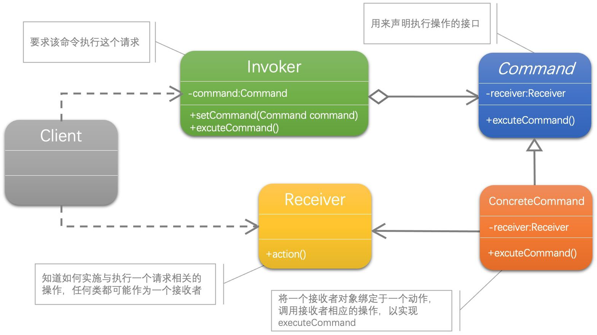
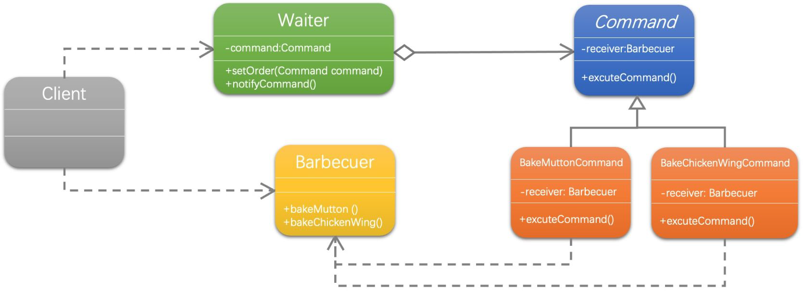

[1]: https://juejin.cn/post/6844903703447765005
[2]: https://github.com/hzgaoshichao/playwithdesignpattern/tree/main/chapter23
[3]: https://design-patterns.readthedocs.io/zh-cn/latest/behavioral_patterns/command.html
[4]: https://book.douban.com/subject/36116620/
[5]: https://design-patterns.readthedocs.io/zh-cn/latest/index.html
## 关于
**大话设计模式 Golang 版** 是将 [<<大话设计模式【Java溢彩加强版】(作者:程杰)>>][4] 里面的 Java 代码用 Golang 重新写了一遍, 然后结合 [图说设计模式][5] 做总结归纳

## 描述
### 定义
命令模式 (Command Pattern)：将一个请求封装为一个对象，从而使我们可用不同的请求对客户进行参数化；对请求排队或者记录请求日志，以及支持可撤销的操作。

### **模式分析**
命令模式的本质是对命令进行封装，将发出命令的责任和执行命令的责任分割开。

- 每一个命令都是一个操作：请求的一方发出请求，要求执行一个操作；接收的一方收到请求，并执行操作。
- 命令模式允许请求的一方和接收的一方独立开来，使得请求的一方不必知道接收请求的一方的接口，更不必知道请求是怎么被接收，以及操作是否被执行、何时被执行，以及是怎么被执行的。
- 命令模式使请求本身成为一个对象，这个对象和其他对象一样可以被存储和传递。
- 命令模式的关键在于引入了抽象命令接口，且发送者针对抽象命令接口编程，只有实现了抽象命令接口的具体命令才能与接收者相关联。

## UML 结构
下面的 UML 图是原书中使用 Java 的 UML 图, 由于 Golang 中没有抽象类, 所以在代码实现时需要将 Java 中的抽象类转换为接口来实现

命令模式包含四个角色：
- 抽象命令类中声明了用于执行请求的 execute() 等方法，通过这些方法可以调用请求接收者的相关操作；
- 具体命令类是抽象命令类的子类，实现了在抽象命令类中声明的方法，它对应具体的接收者对象，将接收者对象的动作绑定其中；
- 调用者即请求的发送者，又称为请求者，它通过命令对象来执行请求；
- 接收者执行与请求相关的操作，它具体实现对请求的业务处理。

- 带空心菱形箭头的直线表示聚合关系 (aggregation)
- 带箭头的虚线表示依赖关系 (dependency)
- 带箭头的实线表示关联关系 (association)

**聚合关系 (aggregation)**

聚合关系用一条带空心菱形箭头的直线表示，如上图表示 Command 聚合到 Invoker 上，或者说 Invoker 由 Command 组成；

聚合关系用于表示实体对象之间的关系，表示整体由部分构成的语义, 表示一种弱的 "拥有"关系, 体现的是A对象可以包含B对象, 但是B对象不是A对象的一部分；例如一个部门由多个员工组成；

与组合关系不同的是，整体和部分不是强依赖的，即使整体不存在了，部分仍然存在；例如， 部门撤销了，人员不会消失，他们依然存在

**依赖关系 (dependency)**

依赖关系 (dependency) 依赖关系是用一条带箭头的虚线表示的；如上图表示 Client 依赖于 Receiver；他描述一个对象在运行期间会用到另一个对象的关系； 与关联关系不同的是，它是一种临时性的关系，通常在运行期间产生，并且随着运行时的变化； 依赖关系也可能发生变化；

显然，依赖也有方向，双向依赖是一种非常糟糕的结构，我们总是应该保持单向依赖，杜绝双向依赖的产生；

注：在最终代码中，依赖关系体现为类构造方法及类方法的传入参数，箭头的指向为调用关系；依赖关系除了临时知道对方外，还是“使用”对方的方法和属性

**关联关系 ( association )**

关联关系是用一条直线表示的；它描述不同类的对象之间的结构关系；它是一种静态关系， 通常与运行状态无关，一般由常识等因素决定的；它一般用来定义对象之间静态的、天然的结构； 所以，关联关系是一种“强关联”的关系；

比如，乘车人和车票之间就是一种关联关系；学生和学校就是一种关联关系；

关联关系默认不强调方向，表示对象间相互知道；如果特别强调方向，如上图中，表示 ConcreteCommand 知道 Receiver，Receiver 不知道 ConcreteCommand；

注：在最终代码中，关联对象通常是以成员变量的形式实现的；

## 代码实现
示例代码 UML 图：

**源码下载地址**: [github.com/chapter23/][2]

## 典型应用场景
在以下情况下可以使用命令模式：

- 系统需要将请求调用者和请求接收者解耦，使得调用者和接收者不直接交互。
- 系统需要在不同的时间指定请求、将请求排队和执行请求。
- 系统需要支持命令的撤销(Undo)操作和恢复(Redo)操作。
- 系统需要将一组操作组合在一起，即支持宏命令

## 优缺点
### 优点
- 降低系统的耦合度。
- 新的命令可以很容易地加入到系统中。
- 可以比较容易地设计一个命令队列和宏命令（组合命令）。
- 可以方便地实现对请求的Undo和Redo。

### 缺点
- 使用命令模式可能会导致某些系统有过多的具体命令类。因为针对每一个命令都需要设计一个具体命令类，因此某些系统可能需要大量具体命令类，这将影响命令模式的使用。

## 参考链接
- [图说设计模式: https://design-patterns.readthedocs.io/][3]
