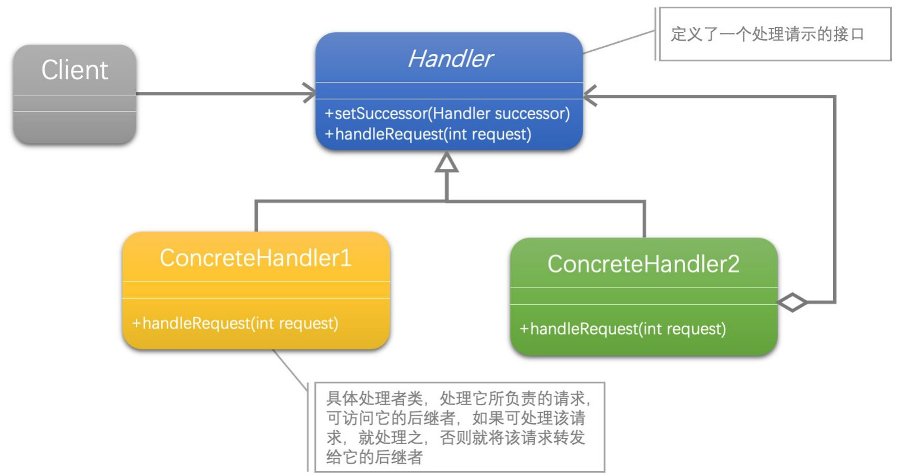
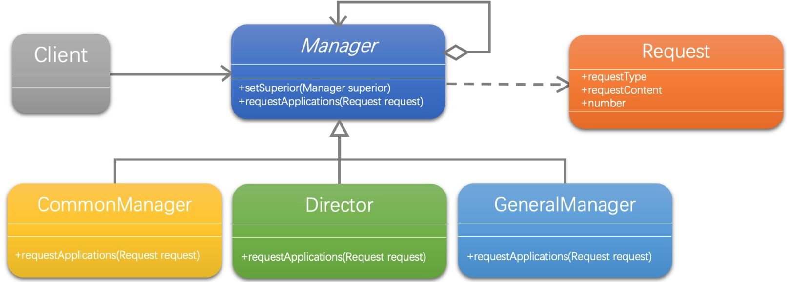

[1]: https://refactoringguru.cn/design-patterns
[2]: https://github.com/hzgaoshichao/playwithdesignpattern/tree/main/chapter24
[3]: https://refactoringguru.cn/design-patterns/chain-of-responsibility
[4]: https://book.douban.com/subject/36116620/
[5]: https://design-patterns.readthedocs.io/zh-cn/latest/index.html
## 关于
**大话设计模式 Golang 版** 是将 [<<大话设计模式【Java溢彩加强版】(作者:程杰)>>][4] 里面的 Java 代码用 Golang 重新写了一遍, 然后结合 [图说设计模式][5] 和 [refactoringguru.cn][1] 做总结归纳

## 描述
### 定义
职责链模式（Chain of Responsibility）：使多个对象都有机会处理请求，从而避免请求的发送者和接收者之间的耦合关系。将这个对象连成一条链，并沿着这条链传递该请求，直到有一个对象处理它为止。

### 模式分析
责任链模式是一种行为设计模式， 允许你将请求沿着处理者链进行发送。 收到请求后，每个处理者均可对请求进行处理， 或将其传递给链上的下个处理者。

## UML 结构
下面的 UML 图是原书中使用 Java 的 UML 图, 由于 Golang 中没有抽象类, 所以在代码实现时需要将 Java 中的抽象类转换为接口来实现

- 带空心菱形箭头的直线表示聚合关系 (aggregation)
- 带箭头的实线表示关联关系 (association)

**聚合关系 (aggregation)**

聚合关系用一条带空心菱形箭头的直线表示，如上图表示 Handler 聚合到 ConcreteHandler 上，或者说 ConcreteHandler 由 Handler 组成；

聚合关系用于表示实体对象之间的关系，表示整体由部分构成的语义, 表示一种弱的 "拥有"关系, 体现的是A对象可以包含B对象, 但是B对象不是A对象的一部分；例如一个部门由多个员工组成；

与组合关系不同的是，整体和部分不是强依赖的，即使整体不存在了，部分仍然存在；例如， 部门撤销了，人员不会消失，他们依然存在

**关联关系 ( association )**

关联关系是用一条直线表示的；它描述不同类的对象之间的结构关系；它是一种静态关系， 通常与运行状态无关，一般由常识等因素决定的；它一般用来定义对象之间静态的、天然的结构； 所以，关联关系是一种“强关联”的关系；

比如，乘车人和车票之间就是一种关联关系；学生和学校就是一种关联关系；

关联关系默认不强调方向，表示对象间相互知道；如果特别强调方向，如上图中，表示 Client 知道 Handler，Handler 不知道 Client；

注：在最终代码中，关联对象通常是以成员变量的形式实现的；

## 代码实现
示例代码 UML 图：

- 带箭头的虚线表示依赖关系 (dependency)

**依赖关系 (dependency)**

依赖关系 (dependency) 依赖关系是用一条带箭头的虚线表示的；如上图表示 Manager 依赖于 Request；他描述一个对象在运行期间会用到另一个对象的关系； 与关联关系不同的是，它是一种临时性的关系，通常在运行期间产生，并且随着运行时的变化； 依赖关系也可能发生变化；

显然，依赖也有方向，双向依赖是一种非常糟糕的结构，我们总是应该保持单向依赖，杜绝双向依赖的产生；

注：在最终代码中，依赖关系体现为类构造方法及类方法的传入参数，箭头的指向为调用关系；依赖关系除了临时知道对方外，还是“使用”对方的方法和属性

**源码下载地址**: [github.com/chapter24/][2]

## 典型应用场景
当程序需要使用不同方式处理不同种类请求， 而且请求类型和顺序预先未知时， 可以使用职责链模式。

- 该模式能将多个处理者连接成一条链。 接收到请求后， 它会 “询问” 每个处理者是否能够对其进行处理。 这样所有处理者都有机会来处理请求。
- 当必须按顺序执行多个处理者时， 可以使用该模式。
- 无论你以何种顺序将处理者连接成一条链， 所有请求都会严格按照顺序通过链上的处理者。
- 如果所需处理者及其顺序必须在运行时进行改变，可以使用责任链模式。
- 如果在处理者类中有对引用成员变量的设定方法， 你将能动态地插入和移除处理者，或者改变其顺序。

## 优缺点
### 优点
- 你可以控制请求处理的顺序。
- 单一职责原则。你可对发起操作和执行操作的类进行解耦。
- 开闭原则。你可以在不更改现有代码的情况下在程序中新增处理者。

### 缺点
- 部分请求可能无法到达链尾。
- 其他请求可能直到链尾都未被处理。

## 参考链接
- [责任链模式: refactoringguru.cn][3]
