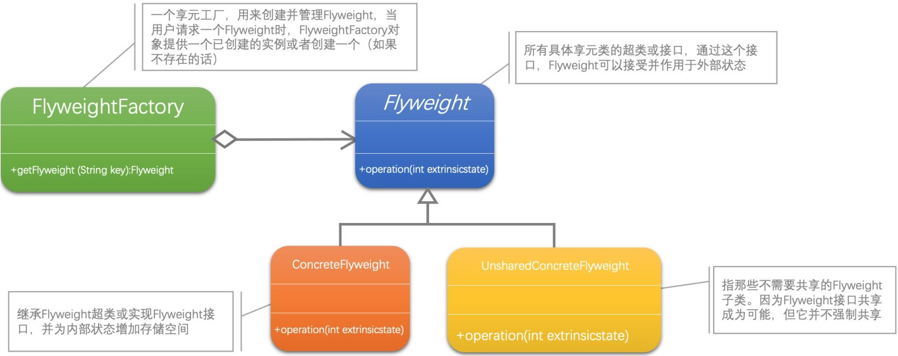
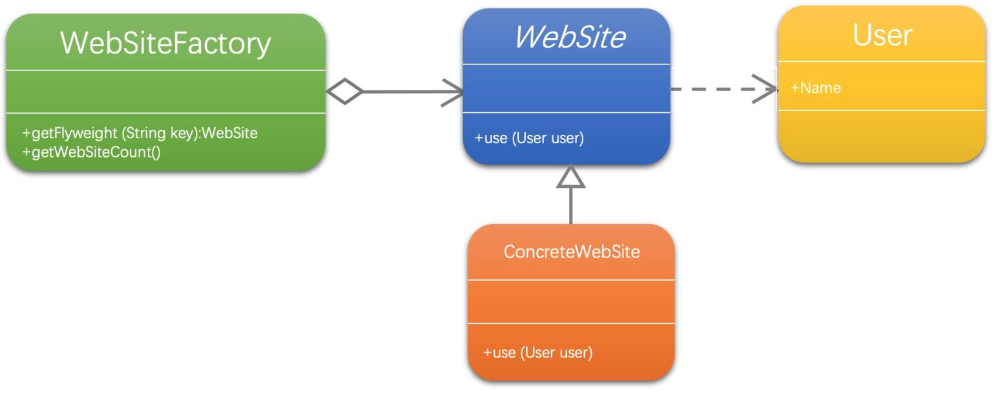

[1]: https://refactoringguru.cn/design-patterns
[2]: https://github.com/hzgaoshichao/playwithdesignpattern/tree/main/chapter26
[3]: https://design-patterns.readthedocs.io/zh-cn/latest/structural_patterns/flyweight.html
[4]: https://book.douban.com/subject/36116620/
[5]: https://design-patterns.readthedocs.io/zh-cn/latest/index.html
## 关于
**大话设计模式 Golang 版** 是将 [<<大话设计模式【Java溢彩加强版】(作者:程杰)>>][4] 里面的 Java 代码用 Golang 重新写了一遍, 然后结合 [图说设计模式][5] 和 [refactoringguru.cn][1] 做总结归纳

## 描述
### 定义
享元模式 (Flyweight Pattern)：运用共享技术有效地支持大量细粒度对象的复用。系统只使用少量的对象，而这些对象都很相似，状态变化很小，可以实现对象的多次复用。由于享元模式要求能够共享的对象必须是细粒度对象，因此它又称为轻量级模式，它是一种对象结构型模式。

### 模式动机
面向对象技术可以很好地解决一些灵活性或可扩展性问题，但在很多情况下需要在系统中增加类和对象的个数。当对象数量太多时，将导致运行代价过高，带来性能下降等问题。

- 享元模式正是为解决这一类问题而诞生的。享元模式通过共享技术实现相同或相似对象的重用。
- 在享元模式中可以共享的相同内容称为内部状态(IntrinsicState)，而那些需要外部环境来设置的不能共享的内容称为外部状态(Extrinsic State)，由于区分了内部状态和外部状态，因此可以通过设置不同的外部状态使得相同的对象可以具有一些不同的特征，而相同的内部状态是可以共享的。
- 在享元模式中通常会出现工厂模式，需要创建一个享元工厂来负责维护一个享元池(Flyweight Pool)用于存储具有相同内部状态的享元对象。
- 在享元模式中共享的是享元对象的内部状态，外部状态需要通过环境来设置。在实际使用中，能够共享的内部状态是有限的，因此享元对象一般都设计为较小的对象，它所包含的内部状态较少，这种对象也称为细粒度对象。享元模式的目的就是使用共享技术来实现大量细粒度对象的复用。

### 模式分析
享元模式是一个考虑系统性能的设计模式，通过使用享元模式可以节约内存空间，提高系统的性能。

- 享元模式的核心在于享元工厂类，享元工厂类的作用在于提供一个用于存储享元对象的享元池，用户需要对象时，首先从享元池中获取，如果享元池中不存在，则创建一个新的享元对象返回给用户，并在享元池中保存该新增对象。
- 
- 享元模式以共享的方式高效地支持大量的细粒度对象，享元对象能做到共享的关键是区分内部状态 (Internal State) 和外部状态 (External State)。
- 
- 内部状态是存储在享元对象内部并且不会随环境改变而改变的状态，因此内部状态可以共享。
- 外部状态是随环境改变而改变的、不可以共享的状态。享元对象的外部状态必须由客户端保存，并在享元对象被创建之后，在需要使用的时候再传入到享元对象内部。一个外部状态与另一个外部状态之间是相互独立的。

## UML 结构
下面的 UML 图是原书中使用 Java 的 UML 图, 由于 Golang 中没有抽象类, 所以在代码实现时需要将 Java 中的抽象类转换为接口来实现

- 带空心菱形箭头的直线表示聚合关系 (aggregation)

**聚合关系 (aggregation)**

聚合关系用一条带空心菱形箭头的直线表示，如上图表示 Flyweight 聚合到 FlyweightFactory 上，或者说 FlyweightFactory 由 Flyweight 组成；

聚合关系用于表示实体对象之间的关系，表示整体由部分构成的语义, 表示一种弱的 "拥有"关系, 体现的是A对象可以包含B对象, 但是B对象不是A对象的一部分；例如一个部门由多个员工组成；

与组合关系不同的是，整体和部分不是强依赖的，即使整体不存在了，部分仍然存在；例如， 部门撤销了，人员不会消失，他们依然存在

## 代码实现
示例代码 UML 图：

- 带箭头的虚线表示依赖关系 (dependency)

**依赖关系 (dependency)**

依赖关系 (dependency) 依赖关系是用一条带箭头的虚线表示的；如上图表示 WebSite 依赖于 User；他描述一个对象在运行期间会用到另一个对象的关系； 与关联关系不同的是，它是一种临时性的关系，通常在运行期间产生，并且随着运行时的变化； 依赖关系也可能发生变化；

显然，依赖也有方向，双向依赖是一种非常糟糕的结构，我们总是应该保持单向依赖，杜绝双向依赖的产生；

注：在最终代码中，依赖关系体现为类构造方法及类方法的传入参数，箭头的指向为调用关系；依赖关系除了临时知道对方外，还是“使用”对方的方法和属性

**源码下载地址**: [github.com/chapter25/][2]

## 典型应用场景
在以下情况下可以使用享元模式：

- 一个系统有大量相同或者相似的对象，由于这类对象的大量使用，造成内存的大量耗费。
- 对象的大部分状态都可以外部化，可以将这些外部状态传入对象中。
- 使用享元模式需要维护一个存储享元对象的享元池，而这需要耗费资源，因此，应当在多次重复使用享元对象时才值得使用享元模式。

## 优缺点
### 优点
- 享元模式的优点在于它可以极大减少内存中对象的数量，使得相同对象或相似对象在内存中只保存一份。
- 享元模式的外部状态相对独立，而且不会影响其内部状态，从而使得享元对象可以在不同的环境中被共享。

### 缺点
- 享元模式使得系统更加复杂，需要分离出内部状态和外部状态，这使得程序的逻辑复杂化。
- 为了使对象可以共享，享元模式需要将享元对象的状态外部化，而读取外部状态使得运行时间变长。

## 参考链接
- [享元模式: https://design-patterns.readthedocs.io/][3]
