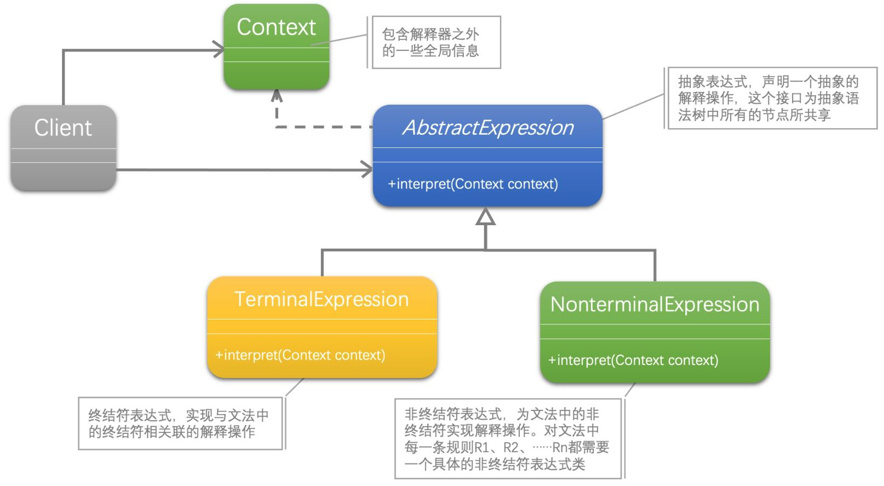
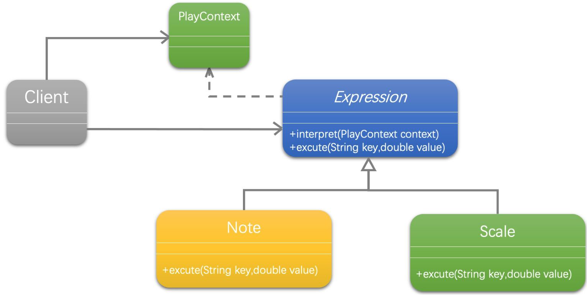

[1]: https://refactoringguru.cn/design-patterns
[2]: https://github.com/hzgaoshichao/playwithdesignpattern/tree/main/chapter27
[3]: https://design-patterns.readthedocs.io/zh-cn/latest/structural_patterns/flyweight.html
[4]: https://book.douban.com/subject/36116620/
[5]: https://design-patterns.readthedocs.io/zh-cn/latest/index.html
## 关于
**大话设计模式 Golang 版** 是将 [<<大话设计模式【Java溢彩加强版】(作者:程杰)>>][4] 里面的 Java 代码用 Golang 重新写了一遍, 然后结合 [图说设计模式][5] 和 [refactoringguru.cn][1] 做总结归纳

## 描述
### 定义
解释器模式（interpreter），给定一个语言，定义它的文法的一种表示，并定义一个解释器，这个解释器使用该表示来解释语言中的句子。

## UML 结构
下面的 UML 图是原书中使用 Java 的 UML 图, 由于 Golang 中没有抽象类, 所以在代码实现时需要将 Java 中的抽象类转换为接口来实现

- 带箭头的虚线表示依赖关系 (dependency)
- 带箭头的实线表示关联关系 (association)

**依赖关系 (dependency)**

依赖关系 (dependency) 依赖关系是用一条带箭头的虚线表示的；如上图表示 AbstractExpression 依赖于 Context；他描述一个对象在运行期间会用到另一个对象的关系； 与关联关系不同的是，它是一种临时性的关系，通常在运行期间产生，并且随着运行时的变化； 依赖关系也可能发生变化；

显然，依赖也有方向，双向依赖是一种非常糟糕的结构，我们总是应该保持单向依赖，杜绝双向依赖的产生；

注：在最终代码中，依赖关系体现为类构造方法及类方法的传入参数，箭头的指向为调用关系；依赖关系除了临时知道对方外，还是“使用”对方的方法和属性

**关联关系 ( association )**

关联关系是用一条直线表示的；它描述不同类的对象之间的结构关系；它是一种静态关系， 通常与运行状态无关，一般由常识等因素决定的；它一般用来定义对象之间静态的、天然的结构； 所以，关联关系是一种“强关联”的关系；

比如，乘车人和车票之间就是一种关联关系；学生和学校就是一种关联关系；

关联关系默认不强调方向，表示对象间相互知道；如果特别强调方向，如上图中，表示 Client 知道 Context，Context 不知道 Client；

注：在最终代码中，关联对象通常是以成员变量的形式实现的；

## 代码实现
示例代码 UML 图：

**源码下载地址**: [github.com/chapter27/][2]

## 典型应用场景
通常当有一个语言需要解释执行，并且你可将该语言中的句子表示为一个抽象语法树时，可使用解释器模式。比如像正则表达式、浏览器等应用

## 优缺点
### 优点
用了解释器模式，就意味着可以很容易地改变和扩展文法，因为该模式使用类来表示文法规则，你可使用继承来改变或扩展该文法。也比较容易实现文法，因为定义抽象语法树中各个节点的类的实现大体类似，这些类都易于直接编写。

### 缺点
解释器模式为文法中的每一条规则至少定义了一个类，因此包含许多规则的文法可能难以管理和维护。建议当文法非常复杂时，使用其他的技术如语法分析程序或编译器生成器来处理

