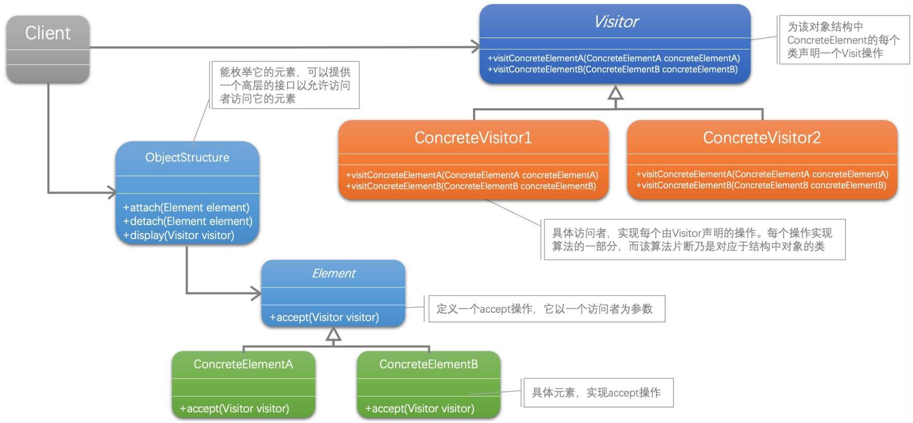
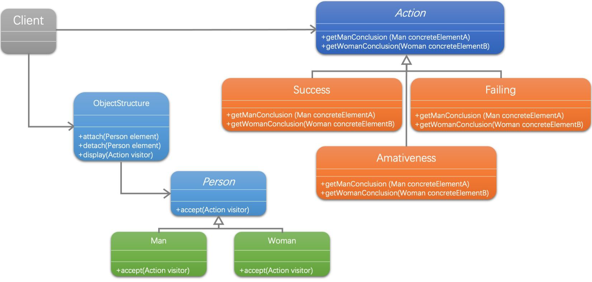

[1]: https://refactoringguru.cn/design-patterns
[2]: https://github.com/hzgaoshichao/playwithdesignpattern/tree/main/chapter28
[3]: https://refactoringguru.cn/design-patterns/visitor
[4]: https://book.douban.com/subject/36116620/
[5]: https://design-patterns.readthedocs.io/zh-cn/latest/index.html
## 关于
**大话设计模式 Golang 版** 是将 [<<大话设计模式【Java溢彩加强版】(作者:程杰)>>][4] 里面的 Java 代码用 Golang 重新写了一遍, 然后结合 [图说设计模式][5] 和 [refactoringguru.cn][1] 做总结归纳

## 描述
### 定义
访问者模式 （Visitor），表示一个作用于某对象结构中的各元素的操作。它使你可以在不改变各元素的类的前提下定义作用于这些元素的新操作。

## UML 结构
下面的 UML 图是原书中使用 Java 的 UML 图, 由于 Golang 中没有抽象类, 所以在代码实现时需要将 Java 中的抽象类转换为接口来实现



- 带箭头的实线表示关联关系 (association)

**关联关系 ( association )**

关联关系是用一条直线表示的；它描述不同类的对象之间的结构关系；它是一种静态关系， 通常与运行状态无关，一般由常识等因素决定的；它一般用来定义对象之间静态的、天然的结构； 所以，关联关系是一种“强关联”的关系；

比如，乘车人和车票之间就是一种关联关系；学生和学校就是一种关联关系；

关联关系默认不强调方向，表示对象间相互知道；如果特别强调方向，如上图中，表示 Client 知道 ObjectStructure，ObjectStructure 不知道 Client；

注：在最终代码中，关联对象通常是以成员变量的形式实现的；


## 代码实现
示例代码 UML 图：



**双分派技术**

这里需要提一下当中用到一种双分派的技术，首先在客户程序中将具体状态作为参数传递给'男人'类完成了一次分派，然后'男人'类调用作为参数的'具体状态'中的方法'男人反应'，同时将自己（this）作为参数传递进去。这便完成了第二次分派。双分派意味着得到执行的操作决定于请求的种类和两个接收者的类型。'接受'方法就是一个双分派的操作，它得到执行的操作不仅决定于'状态'类的具体状态，还决定于它访问的'人'的类别。
```go
func (m *Man) accept(visitor Action) {
	visitor.GetManConclusion(m) // 双分派技术
}

type Woman struct {
}

func (w *Woman) accept(visitor Action) {
	visitor.GetWomanConclusion(w) // 双分派技术
}
```


**源码下载地址**: [github.com/chapter28/][2]

## 典型应用场景
访问者模式适用于数据结构相对稳定的系统, 它把数据结构和作用于结构上的操作之间的耦合解脱开，使得操作集合可以相对自由地演化.

访问者模式的目的是要把处理从数据结构分离出来。很多系统可以按照算法和数据结构分开，如果这样的系统有比较稳定的数据结构，又有易于变化的算法的话，使用访问者模式就是比较合适的，因为访问者模式使得算法操作的增加变得容易。反之，如果这样的系统的数据结构对象易于变化，经常要有新的数据对象增加进来，就不适合使用访问者模式。

## 优缺点
### 优点
访问者模式的优点就是增加新的操作很容易，因为增加新的操作就意味着增加一个新的访问者。访问者模式将有关的行为集中到一个访问者对象中。

### 缺点
访问者的缺点其实也就是使增加新的数据结构变得困难了, 每次在元素层次结构中添加或移除一个类时， 你都要更新所有的访问者。

所以GoF四人中的一个作者就说过：'大多时候你并不需要访问者模式，但当一旦你需要访问者模式时，那就是真的需要它了。'事实上，我们很难找到数据结构不变化的情况，所以用访问者模式的机会也就不太多了。

